# The Camera

***WARNING:* You have to complete both [Hello World](/hello-world/hello-world.md) and [Introduction to Physics](/physics/introduction-to-physics.md) tutorials first before starting this one.** 

Welcome!

In this tutorial we're gonna teach you the basics of camera control.

Since you've already went through the "Hello World" tutorial, and the "Introduction to Physics" tutorial, this is gonna be easy!

But first, you might've be asking yourself...

## What is the Camera?

The Camera is basically the object that is responsible for bringing this entire virtual world to your screen.

Let me give you an example: after you finished the "Introduction to Physics" tutorial, this was the final result.

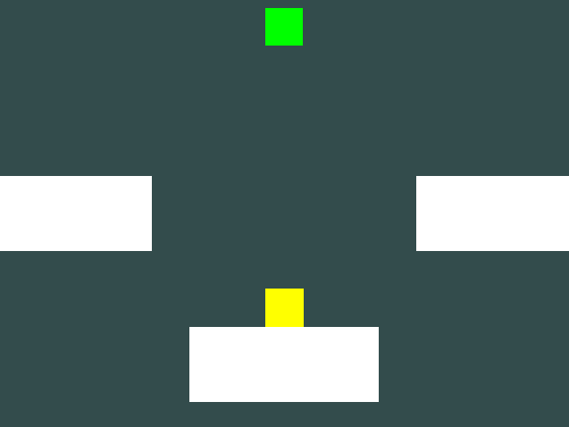

Everything you see here is thanks to the Camera object, that by default, is placed in the (0, 0, 2) position.


Thanks to the Camera, you can basically see your game!

Now that you learned about the Camera object...

## Let's do some testing examples!

Let's go back to our final Physics tutorial project we've made...

Inside GameMain.h, we're going to zoom out by moving the camera in the Z axis.

- First, we get the camera object.

	The camera is ```Graphics::MainCamera()```.

	The "Main Camera" is basically a ScriptBehaviour object, so we can use ```GetTransform().position```, to change its position.

- With this information, since by default its in the (0, 0, 2) position, let's move it backwards by "10" in the Z axis, making its final position be (0, 0, 10).

	```cpp
	Graphics::MainCamera()->GetTransform().position = Vector3(0, 0, 10);
	```

## 1st Result.

If we compile and run it, you can see that now the camera is now further away from its last position!

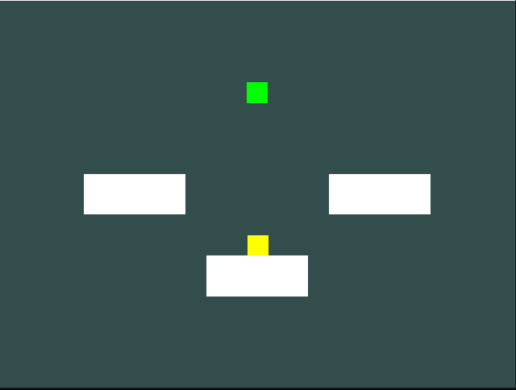

## Camera Rotation

Now let's take a look at how to rotate the camera!

In traditional video production (like movies, series, etc.) the camera has its own names for rotation movement:

- The *blue* direction is called **Pan**.
- The *green* one is **Tilt**.
- And the *red* is **Roll**.

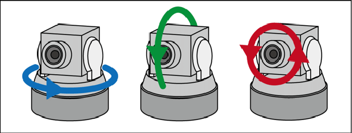

Original Source from: https://www.researchgate.net/figure/Camera-angles-pan-tilt-roll_fig17_347528033 

- The term "**Panning**" is rotating the camera horizontally (left or right).
- The term "**Tilting**" is rotating the camera vertically (up or down).
- And the term "**Rolling**" is rotating the camera like a wheel.

Now, we can apply those terms in the game with:

## The "Euler Angles".

The Euler Angles of a camera is basically its rotation (X/Y/Z) in form of degrees.

The types of rotation movement we've seen earlier **apply** to the Euler Angles:

- Changing the X axis is **Panning**.
- Changing the Y axis is **Tilting**.
- Changing the Z axis is **Rolling**.

Rolling is used a lot on 2D games for rotating the camera inside the two-dimensional world.

And on 3D games, all of the three axis are mostly used.

In this engine *you can* use all three axises no matter if your game is a 2D, 2.5D or a 3D game. Some games exist out there that are 2D and use 3D rotation cameras to achieve some sort of crazy effect/perspective!

(*And the same applies to camera position, you can go wild if you want to :D*)

Let me demonstrate in form of drawings:

We have our **Camera**, and a **Wall**:

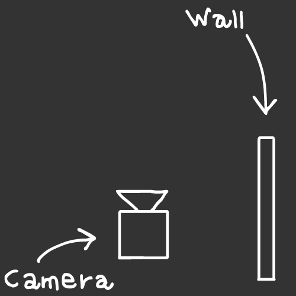

The wall is not in front of the camera, its on the right, and we want the camera to look at it:

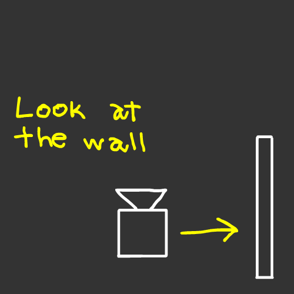

How do we achieve that?

By rotating the camera's euler X axis, meaning, we **pan** the camera 90° to the right, where the wall is currently located:

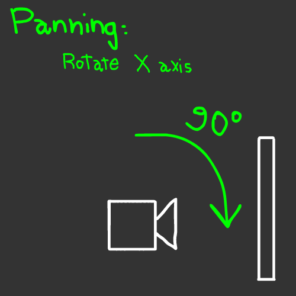

This is one of the many examples of what you can do with the camera's rotation. If you want to look at something that is up in the sky, you can tilt the camera by changing its euler Y axis. Or if you want to spin the camera like a wheel running down the hill, you can roll it by changing its euler Z axis.

So, now that you know all of this...

## Let's get into coding again!

Going back to our GameMain.h, we're gonna try to plan a shot for the camera:

We're gonna pan the camera 45° to the right and translate it a bit so the whole platformer is in the center of the screen.

First, we rotate by changing the "eulerAngles" vector of the camera. By default, the Euler Angles start as (0, 90, 0), so we're gonna add (45, 0, 0).

So you can code it in two ways:

By adding the X axis.

```cpp
Graphics::MainCamera()->eulerAngles += Vector3(45, 0, 0);
```

Or by setting the entire vector.

```cpp
Graphics::MainCamera()->eulerAngles = Vector3(45, 90, 0);
```

## 2nd Result.

If we compile and run it, the rotation works!


But its not centered properly...

Remember the wall example. Since we panned the camera 45° to the right, our focus gets shifted.

So to maintain that angle, we need to move the camera so it gets centered properly to our screen, since that's the main goal of it.

## Let's translate the Camera!

I'm going to shift its X position to the left, and get it closer to the scene by modifying its Z position.

```cpp
Graphics::MainCamera()->GetTransform().position = Vector3(-15, 0, 5);
```

## Final Result.

If we compile and run it... Now it looks rotated and centered to the screen!

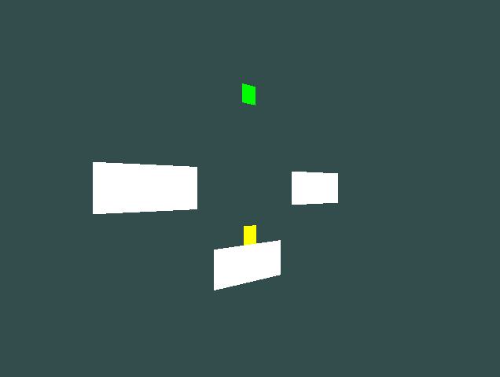

## Now its your turn to experiment!

Since you know how to move and rotate you can try and experiment with it!

## Some examples.

### Example 1.

Do the same scene but we pan the camera to the left instead:

```cpp
Graphics::MainCamera()->GetTransform().position = Vector3(15, 0, 5);
Graphics::MainCamera()->eulerAngles += Vector3(-45, 0, 0);
```

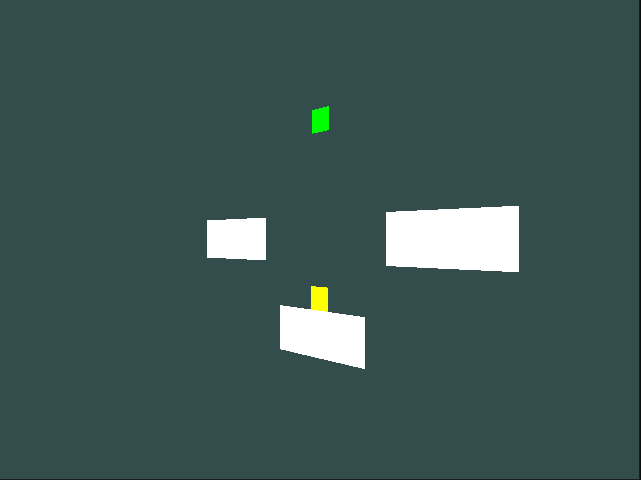

### Example 2

If you want to keep it as 2D, you can try rotating the camera in its Z axis!

Let's say roll by 30° to the left:

```cpp
Graphics::MainCamera()->GetTransform().position = Vector3(0, 0, 10);
Graphics::MainCamera()->eulerAngles += Vector3(0, 0, -30);
```

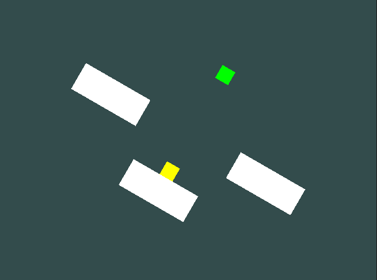

### Example 3

What if we do the same thing as the last example, but we turn everything upside down instead?

```cpp
Graphics::MainCamera()->GetTransform().position = Vector3(0, 0, 10);
Graphics::MainCamera()->eulerAngles += Vector3(0, 0, 180);
```

This one is trippy, have fun! :)

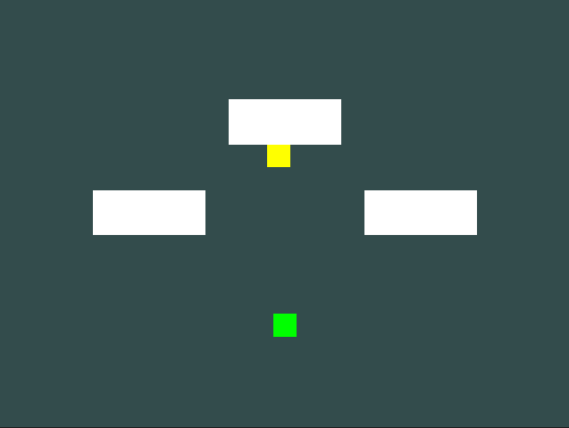

### Example 4

What if we tilt the camera and look the entire scene from below?

```cpp
Graphics::MainCamera()->GetTransform().position = Vector3(0, -20, 10);
Graphics::MainCamera()->eulerAngles += Vector3(0, 45, 0);
```

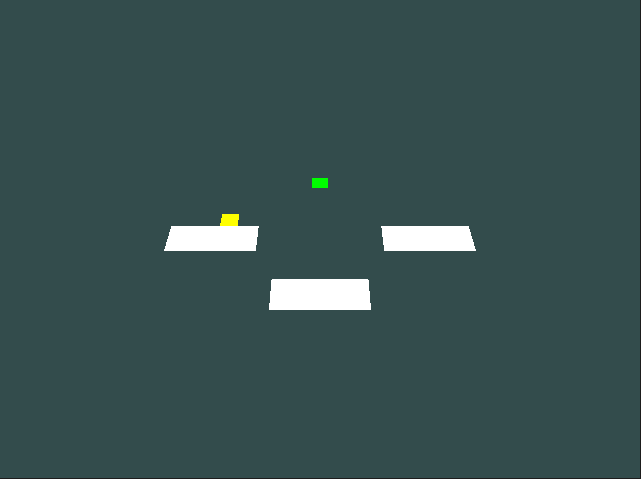

### Example 5

Or maybe doing the opposite of the last example and look at it from above?

```cpp
Graphics::MainCamera()->GetTransform().position = Vector3(0, 20, 10);
Graphics::MainCamera()->eulerAngles += Vector3(0, -45, 0);
```

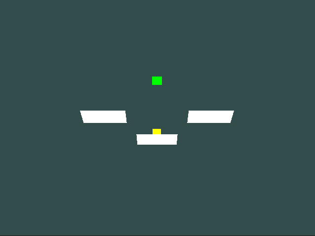


## Posibilities are endless!

Go experiment and even mix some of the stuff!

You can even add scripts to the Camera and make your own logic out of it!

```cpp
Graphics::MainCamera()->AddScript<MyScript>();
```

Go and have fun :D

## Congratulations!

You successfully completed the Camera tutorial! :D

Feel free to go and read other tutorials, and hope you enjoyed this one :)