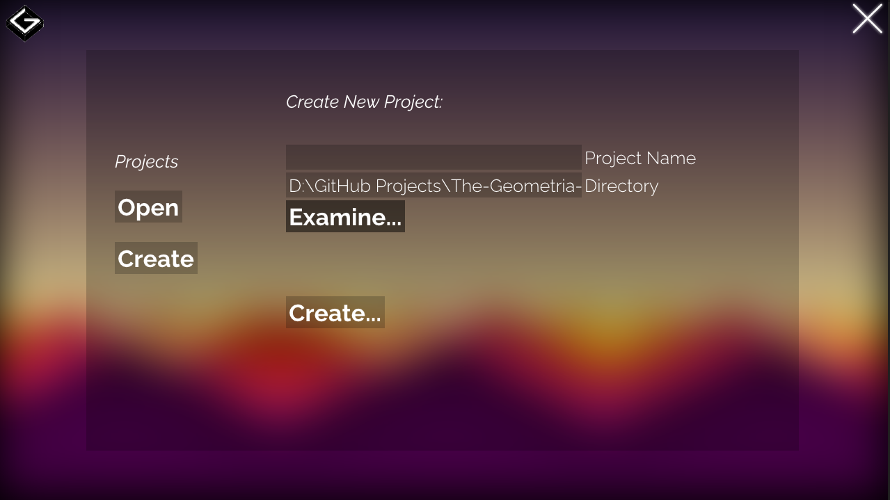

# Getting Started

## Windows

> [!WARNING]
> This part of the documentation is not complete!

To get started, you need to install:

- Git.
- Visual Studio Build Tools.
- Windows SDK.

Once that's done, download the latest version of **Geometria Hub** and open it up.

Inside the app, you can set the name of your project, and in what directory is going to get added.
And once you have that stuff done, you can click on the **"Create"** button and Geometria Hub is going to automatically create and set it up for you.

> [!TIP]
> You can see the whole creation process in the console that Geometria Hub has.

If the creation process goes according to plan and Geometria Hub gives you the message that is complete, then congrats! 
You succesfully created your first project!

Now you can feel free to close Geometria Hub, go to your projects folder, and start following the [Hello World](/hello-world/hello-world.md) tutorial!

## Linux

> [!WARNING]
> This section of the docs needs to be added!