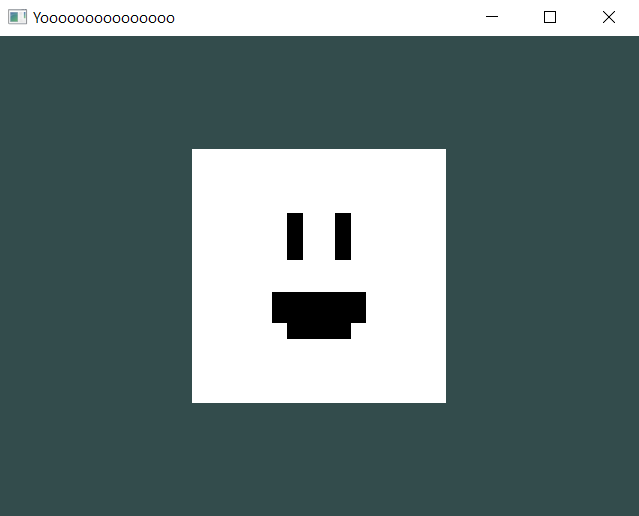

# Adding Textures/Images.

In this part of the "Hello World" tutorial, you're going to learn how to add textures.

## First of all...

You need to know that most textures are preloaded in order to get them batched. 
There's still no "Runtime Loading" textures yet, but they're gonna be a thing in the future.

For now, every texture you load needs to be preloaded first.

## Second of all...

At the moment it can only load .png files, in the future its going to load other formats.

## How to load a Texture.

Loading a Texture is pretty easy!

If you're planning to add it in your game, make sure that's inside of the "Game" folder or sub-folders inside of "Game".

In this particular case, i'm gonna use this texture:


> [!TIP|style:flat|label:URGENT]
> This neat little guy is called Billy, say hi to Billy! :D

For this tutorial, Billy is going to be located in the "Game" folder, right here:

```text
.
├── Game
|	├── GameMain.h
|	├── billy.png
|	└── ...
└── ...
```

Now that we added Billy inside our game, let's go back to the code so it can be added to a simple square.

### Going back to the code...

For this, we're going to set up a simple scene with only a square, like we did in the "Changing the Color of a Model" tutorial.

```cpp
#pragma once

#include "geometria.h"

struct GameMain
{
	static void Init()
	{
		DrawCall* d = SceneManager::MainScene().CreateDrawCall();
		Model* model = new Model(Model::Primitives::SQUARE, Vector3(0), Vector3(0), Vector3(1));
		RendererCore::AddModel(*model, d->Target());
	}
};
```

Before the creation of a Draw Call, we're going to create the Texture like this:

```cpp
Texture* t = new Texture("Game/billy.png", Texture::Type::Default);
TextureManager::UploadToGPU();
```

In here, we're creating a Texture, with the first parameter being a path to the image, and the type, which is the default type.

> [!TIP]
> The root of the path in your game is always "Game", so if its in a sub-folder or inside other sub-folders you created, it needs to start from "Game".
> Example: "Game/Other/Sub/Folders/billy.png".

And once we're done initializing textures, we upload them to the GPU with `TextureManager::UploadToGPU();`.

## Once we loaded the Textures in-game...

We can add it to our model, before adding it to the Draw Call:

```cpp
model->texture = t;
```

## The End Result in your Code.

The final result should look like this:

```cpp
#pragma once

#include "geometria.h"

struct GameMain
{
	static void Init()
	{
		Texture* t = new Texture("Game/billy.png", Texture::Type::Default);
		TextureManager::UploadToGPU();

		DrawCall* d = SceneManager::MainScene().CreateDrawCall();
		Model* model = new Model(Model::Primitives::SQUARE, Vector3(0), Vector3(0), Vector3(1));
		model->texture = t;
		RendererCore::AddModel(*model, d->Target());
	}
};
```

## Final Result.

After compiling and opening our executable, you should see this as a result:



> [!TIP|style:flat|label:URGENT]
> Look at Billy so happy in your scene! What a chad! :D

## If you wanna add more than one texture...

Don't call TextureManager::UploadToGPU() every time you wanna add a texture:

> [!WARNING|style:flat|label:DONT DO THIS]
```cpp
	static void Init()
	{
		Texture* t = new Texture("Game/billy.png", Texture::Type::Default);
		TextureManager::UploadToGPU();
	
		Texture* t2 = new Texture("Game/billy2.png", Texture::Type::Default);
		TextureManager::UploadToGPU();
	
		Texture* t3 = new Texture("Game/billy3.png", Texture::Type::Default);
		TextureManager::UploadToGPU();
	
		Texture* t4 = new Texture("Game/billy4.png", Texture::Type::Default);
		TextureManager::UploadToGPU();
	
		Texture* t5 = new Texture("Game/billy5.png", Texture::Type::Default);
		TextureManager::UploadToGPU();
	
		... // More code.

	}
```

> [!TIP|style:flat|label:DO THIS]
```cpp
	static void Init()
	{
		Texture* t = new Texture("Game/billy.png", Texture::Type::Default);
		Texture* t2 = new Texture("Game/billy2.png", Texture::Type::Default);
		Texture* t3 = new Texture("Game/billy3.png", Texture::Type::Default);
		Texture* t4 = new Texture("Game/billy4.png", Texture::Type::Default);
		Texture* t5 = new Texture("Game/billy5.png", Texture::Type::Default);
	
		TextureManager::UploadToGPU();
	
		... // More code.

	}
```

### Why not?

Calling that function one texture at a time can cause big performance issues while loading.

### You can call "UploadToGPU()" if:

You're adding another big set of textures mid-game. For example:

```cpp
	static void Init()
	{
		Texture* t = new Texture("Game/billy.png", Texture::Type::Default);
		... // Loading a Set of Textures.
		TextureManager::UploadToGPU();

		... // More code.

		Texture t1000 = new Texture("Game/billy1000.png", Texture::Type::Default);
		... // Loading Another Set of Textures.
		TextureManager::UploadToGPU();

		... // More code.
	}
```

## Congrats!

You now know how to load textures!

Now its time to know how to do scripting and add life to your game in the [Introducing "ScriptBehaviour"](/hello-world/introducing-scriptbehaviour.md) tutorial!
