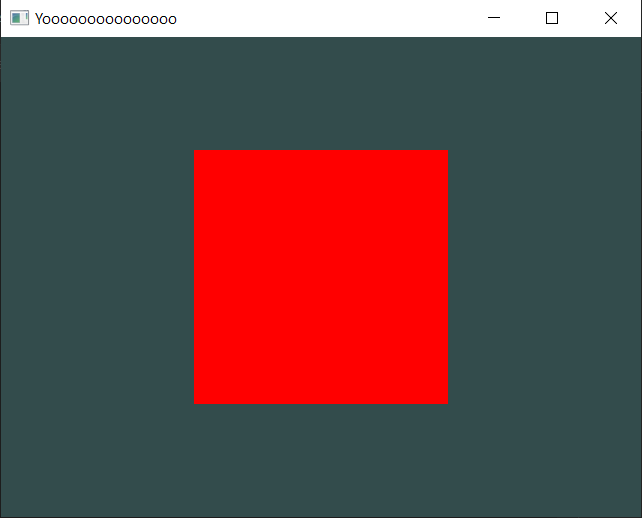
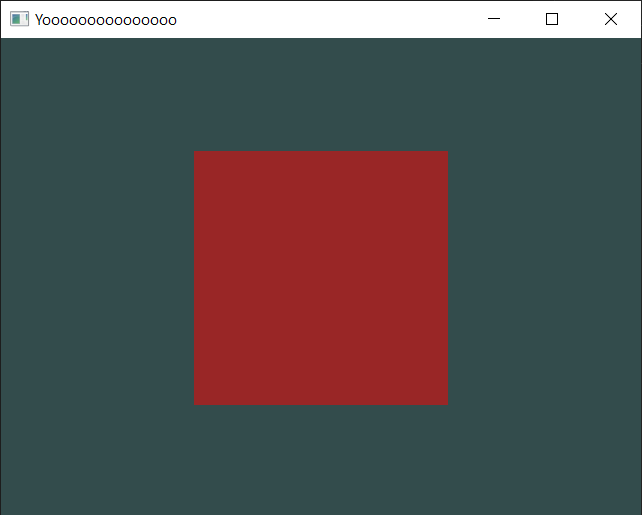

# Changing the Color of a Model

For this next section, you're gonna see how you change the color of a Model.

## Let's start with just a square...

Let's set up a simple scene with a square.

```cpp
static void Init()
{
    DrawCall* d = SceneManager::MainScene().CreateDrawCall();
    Model* model = new Model(Model::Primitives::SQUARE, Vector3(0, 0, 0), Vector3(0, 0, 0), Vector3(1, 1, 1));
    RendererCore::AddModel(*model, d->Target());
}
```

But what if you wanna change it to red?

Well, its simple, between the model instantiation and the AddModel void, you can add this:

```cpp
model->color = Color(1, 0, 0); // Changes it to red.
```

This basically changes the color to red.

> [!TIP]
> The parameters inside Color() are the classical "RGB" parameters. So in here, RED is all the way up, but GREEN and BLUE are all the way down.

The whole Init() void should look like this now.

```cpp
static void Init()
{
    DrawCall* d = SceneManager::MainScene().CreateDrawCall();
    Model* model = new Model(Model::Primitives::SQUARE, Vector3(0, 0, 0), Vector3(0, 0, 0), Vector3(1, 1, 1));
    model->color = Color(1, 0, 0);
    RendererCore::AddModel(*model, d->Target());
}
```

Once you compile and open the executable, its gonna look like this:



## You can change its transparency aswell.

You can add a forth parameter that changes the object's transparency:

```cpp
model->color = Color(1, 0, 0, 0.5); // Changes it to red with half transparency.
```

If you compile and open again, it'll look like this:



Congrats! Now you know how to change the color of a model!

Feel free to play around with everything that has been done so far. You can go crazy and combine everything you learned so far!

Next up is: [Adding Textures/Images](/hello-world/adding-textures.md).