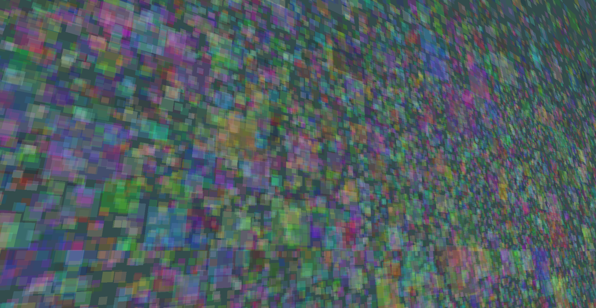

# Draw Call Batching

In this section, you're gonna see one of Geometria's greatest strenghts when it comes to graphics.

## Let's start by giving you a situation.

Imagine that, you wanna spawn **1000 Squares** in the entire scene.

Well, the first thing you're probably gonna do is a "for loop" that spawns 1000 Squares in a random direction.

```cpp
...
    static void Init()
    {
    	...

    	for(int i = 0; i < 1000; i++)
    	{
    		// Set up a Draw Call.
        	DrawCall* d = SceneManager::MainScene().CreateDrawCall();

        	// Create a square with a random X, Y and Z positions.
        	// The "randomX/Y/Z" are probably going to be floats that get randomized as the for loop goes on.
        	Model* model = new Model(Model::Primitives::SQUARE, Vector3(randomX, randomY, randomZ), Vector3(0, 0, 0), Vector3(1, 1, 1));

        	// Add a Model to the Draw Call you created earlier.
        	RendererCore::AddModel(*model, d->Target());
    	}

        ...
    }
...
```

But here comes our first problem: **Spawning too many Draw Calls causes A LOT of lag**.

1000 Draw Calls can be too overwhelming for the CPU to execute every single frame, even on most decent PC laptops.
And you probably want to add more than 1000, what if you wanna add 10k instead? or 100k squares?

Well...

## You can add more than one Model inside a Draw Call.

Instead of making a new Draw Call every time you add a Square, you can create one single Draw Call with all of the squares inside of it.

```cpp
...
    static void Init()
    {
    	...

    	// Set up a Draw Call, but this time, outside of the loop.
        DrawCall* d = SceneManager::MainScene().CreateDrawCall();

    	for(int i = 0; i < 1000; i++)
    	{
        	// Create a square with a random X, Y and Z positions.
        	// The "randomX/Y/Z" are probably going to be floats that get randomized as the for loop goes on.
        	Model* model = new Model(Model::Primitives::SQUARE, Vector3(randomX, randomY, randomZ), Vector3(0, 0, 0), Vector3(1, 1, 1));

        	// Add a Model to the Draw Call you created earlier.
        	RendererCore::AddModel(*model, d->Target());
    	}

        ...
    }
...
```

In here, you're adding **ALL 1000 SQUARES** inside one Draw Call, giving you an **INSANE AMOUNT OF PERFORMANCE**.

And with this, you can increase the count! Go to 10k! Hell, you can go up to 100k, and the game is going to run as smooth as butter!

```cpp
...

// Let's get crazy! :D
// Spawn 100k squares!

for(int i = 0; i < 100000; i++)
{

...
```

This is a screenshot of one of the tests, adding 100k squares inside 1 Draw Call with different colors.

> [!TIP]
> You're going to see how to change the color of a model in the next section of the tutorial.



Thanks to this method of getting everything inside a single Draw Call, this scene can run at 60+ fps with a low CPU and GPU usage.

## This method is known as Draw Call Batching.

Which basically, deep inside the core of the renderer, merges the models you add into one big model and push everything at once to the GPU, instead of pushing one model at a time, causing a performance decrease.

Geometria can batch from vertices, to textures and shaders.

> [!TIP]
> By default in Geometria, you can move one or more of these objects individually without any sort of issue.

Now that you learned this really important part, let's get back to changing a Model.

Next section is: [Changing the Color of a Model](/hello-world/changing-model-color.md). See you there! :D