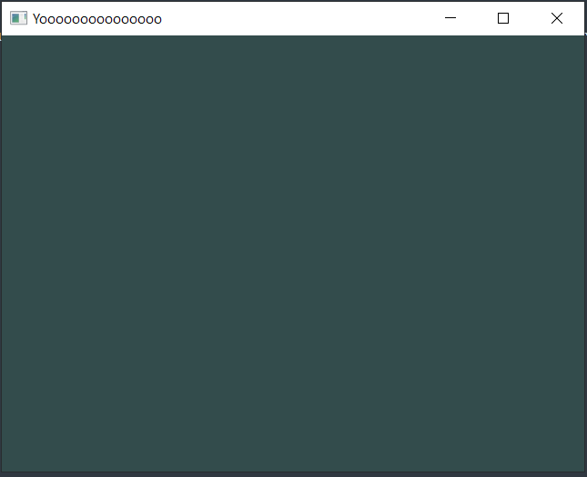
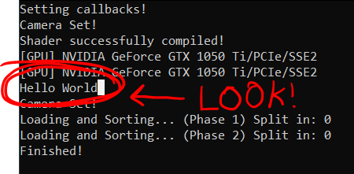

# Hello World!

## Welcome to your first tutorial!

In here, we're gonna teach you how the environment works and print your first hello world to the screen!

## Know your project environment.

If you go to your project folder, you're gonna see this kind of folder structure.

```text
.
├── Geometria
├── Libraries
└── ...
```

The **Geometria** folder is where the engine and your application are. Meanwhile the **Libraries** folder is the one that contains all important libraries for everything to function properly.

## A look at the "Geometria" folder.

If we go inside the **Geometria** folder, you're gonna see A LOT of other folders.

```text
.
├── Geometria
|	├── Application
|	├── Animation
|	└── ...
└── ...
```

Each of these are a part of the engine, one is for app handling, other one for managing input, other one for rendering graphics, etc.

## Where is my game/app? Where do i start?

Your entire app is in one of the sub-folders of the **Geometria** folder called **Game**.

```text
.
├── Geometria
|	├── ...
|	├── Game
|	└── ...
└── ...
```

The **Game** folder is where your entire application is going to be. Everything that is outside of this folder is going to be considered as a part of the engine instead.

Inside of the **Game** folder, you're gonna see a header file called **GameMain.h**.

This header file is the ENTRY POINT of your application, where your app begins executing code.

## The GameMain.h file and print "Hello World".

The file starts like this. Pretty simple to follow.

```cpp
#pragma once

#include "geometria.h"

struct GameMain
{
    static void Init()
    {
        
    }
};
```

The "void Init()" is basically the "int main()" but for Geometria.

In there, you can print anything via "std::cout":

```cpp
static void Init()
{
    std::cout << "Hello World!" << std::endl;	
}
```

The final result is going to look like this:

```cpp
#pragma once

#include "geometria.h"

struct GameMain
{
    static void Init()
    {
        std::cout << "Hello World!" << std::endl;
    }
};
```

Now once you done this, you wanna try it out, but...

## How do you compile the project?

In order to compile the project, open a command prompt in your project folder (outside of the "Geometria" folder) and type `geometria --compile`.
Once you press Enter, its going to set up and compile automatically for you in one go.

If everything compiles correctly without errors, the output is going to be created inside the "Geometria" folder, with the executable having the same name as your project.

## Seeing the result.

When you open the executable, your game is going to show up...



And a the game's console, which is used to debug.
And because you added that print (std::cout) function, your "Hello World!" would appear.



Congrats! You just made your first "Hello World!" inside Geometria.