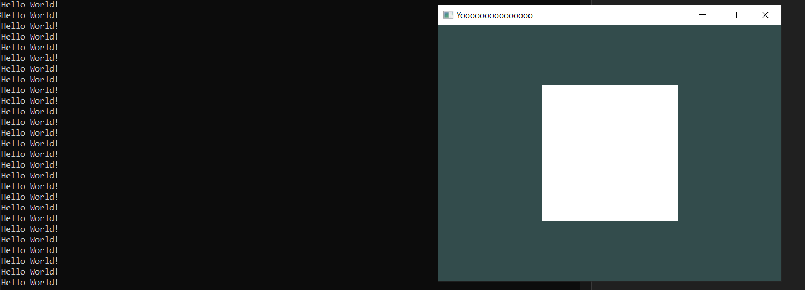

# Introducing "ScriptBehaviour".

In this section, you'll learn how to use the "ScriptBehaviour". One of the most powerful tools in this engine.

## What is "ScriptBehaviour"?

The ScriptBehaviour is a Scripting API that makes your life a lot easier when writing code.

Its useful for making your game logic, tools, managers and programming in general in a clean and organized way.
Without having to hard code anything into the engine, or bundling all your logic into one big script if you don't want to.

This is similar to Unity's "MonoBehaviour" for C# scripting, with the difference being that is compiled instead of hybrid (half interpreted, half compiled).

## Do i need to code in a different programming language?

Nope.
The engine is written in C++, so the ScriptBehaviour's programming language is C++ aswell.

## Let's get started.

First, let's make a new header file in the "Game" directory. 
In here i'm going to call it "SquareScript.h", but you can add any name you want...

```text
.
├── Game
|	├── GameMain.h
|	├── SquareScript.h
|	└── ...
└── ...
```

## Making the script.

### 1. Add preprocessing directives.

Inside the file, we're going to start by adding a `#ifndef & #define` condition, to avoid duplication issues in the future.

Since my header file is called "SquareScript", i could write it like this.

```cpp
#ifndef GAME_SQUARESCRIPT_H
#define GAME_SQUARESCRIPT_H
```

You can put any name you want. I'm just adding it like this to prevent other `#define`s from colliding.

### 2. Include "geometria.h"

By including "geometria.h", you're going to add everything from the engine's API.

```cpp
#include "geometria.h"
```

### 3. Create the class/struct.

Next up, we're going to add the class/struct, which is pretty simple.

In my case, its going to be a struct since i want everything to be public, but you can use a class instead.

```cpp
struct SquareScript : public ScriptBehaviour
{

}; // Remember to add a ";" at the end.
```

> [!TIP]
> Don't forget to add a ";" at the end of the struct/class.

You add the ` : public ScriptBehaviour` at the end to let the compiler know its a ScriptBehaviour struct/class and not a common struct/class.

### 4. Adding OnStart() and OnUpdate().

Inside the struct, add the OnStart() and OnUpdate() voids.

```cpp
struct SquareScript : public ScriptBehaviour
{
	void OnStart()
	{

	}

	void OnUpdate()
	{

	}
}; // Remember to add a ";" at the end.
```

The **OnStart()** void is going to run in the first frame of your game.

And the **OnUpdate()** void is going to run once every frame.

### 4.1. Using both .h and .cpp files (Optional).

If you want to use a .cpp script (if you're dealing with linking issues and/or static parameters, or simply because you don't want to rely on just header files) you can:

- Make a .cpp file with the same name as your .h file.
	
```text
.
├── Game
|	├── GameMain.h
|	├── SquareScript.h
|	├── SquareScript.cpp
|	└── ...
└── ...
```

- Inside the ".h" file, add a ";" to both voids mentioned instead of brackets.

*SquareScript.h*:
```cpp
struct SquareScript : public ScriptBehaviour
{
	void OnStart();
	void OnUpdate();
}; // Remember to add a ";" at the end.
```

- Inside the ".cpp", include the header file, add the OnStart() and OnUpdate(), and add the code you want inside.

*SquareScript.cpp*:
```cpp
#include "SquareScript.h"

void SquareScript::OnStart()
{

}

void SquareScript::OnUpdate()
{

}
```

### 5. Add the #endif directive at the bottom of the header file.

```cpp
... // Top code.

struct SquareScript : public ScriptBehaviour
{
	... // SquareScript code.
}

#endif
```

This is to close the #ifndef we added at the top.

## Add a simple "Hello World" on the Update void.

Just to test the OnUpdate() function, let's add an std::cout.

In this case, i'll be keeping the SquareScript as a "Header only" struct, but you'll still have the same result if you do this via both .h & .cpp.

*SquareScript.h*:
```cpp
void OnStart()
{

}

void OnUpdate()
{
	std::cout << "Hello World!" << std::endl;
}
```

## SquareScript's Final Result.

Once we did all of this, our code should look like this:

### Header only solution:

```cpp
#ifndef GAME_SQUARESCRIPT_H
#define GAME_SQUARESCRIPT_H

#include "geometria.h"

struct SquareScript : public ScriptBehaviour
{
	void OnStart()
	{

	}

	void OnUpdate()
	{
		std::cout << "Hello World!" << std::endl;
	}
};

#endif
```

### .H & .CPP solution:

*SquareScript.h*:
```cpp
#ifndef GAME_SQUARESCRIPT_H
#define GAME_SQUARESCRIPT_H

#include "geometria.h"

struct SquareScript : public ScriptBehaviour
{
	void OnStart();
	void OnUpdate();
};

#endif
```

*SquareScript.cpp*:
```cpp
#include "SquareScript.h"

void SquareScript::OnStart()
{

}

void SquareScript::OnUpdate()
{
	std::cout << "Hello World!" << std::endl;
}
```

## Add the script to an object.

Going back to "GameMain.h", let's add this to an object to make the script work.

We do this by using the `AddScript<>()` function.

Like in the last tutorial, the scene with one square inside "GameMain.h" is being used:

```cpp
#pragma once

#include "geometria.h"
#include "SquareScript.h"

struct GameMain
{
	static void Init()
	{
		DrawCall* d = SceneManager::MainScene().CreateDrawCall();
		Model* model = new Model(Model::Primitives::SQUARE, Vector3(0), Vector3(0), Vector3(1));
		RendererCore::AddModel(*model, d->Target());
	}
};
```

You can see that we included the "SquareScript.h" after including the "geometria.h" file.

```cpp
#include "SquareScript.h"
```

Make sure to add this, otherwise the compiler is not going to know the script exists, and therefor give you an error.

To add the "SquareScript" to the model, we're going to use the `AddScript<>()` like this.

```cpp
model->GetScript<SquareScript>();
```

Betweeen the "<>" you add the ScriptBehaviour class/struct you wanna add to the object.

### Code's Final Result:

```cpp
#pragma once

#include "geometria.h"
#include "SquareScript.h"

struct GameMain
{
	static void Init()
	{
		DrawCall* d = SceneManager::MainScene().CreateDrawCall();
		Model* model = new Model(Model::Primitives::SQUARE, Vector3(0), Vector3(0), Vector3(1));
		model->AddScript<SquareScript>();
		RendererCore::AddModel(*model, d->Target());
	}
};
```

## Final Result.

After compiling and opening the executable, you're gonna see in the console that the model is making a constant spam of "Hello World!" messages.



Congratulations!
You made your first ScriptBehaviour code!

Now in the next section, we're gonna have some good fun: [ScriptBehaviour: Transforming Objects](/hello-world/sb-transforming-objects.md)