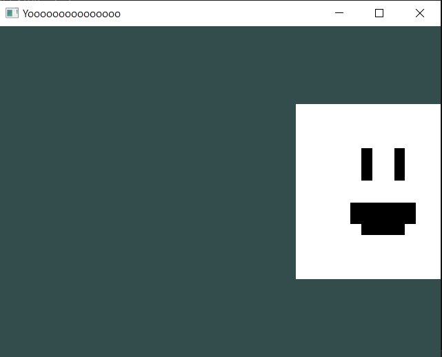

# ScriptBehaviour: Adding Input.

In this tutorial, you're gonna see how to add basic input and make a playable character out of it!

## Let's keep the "Billy" scene from last tutorial...

This time, we're gonna make Billy be able to be controllable via "WASD".

## Let's go back to the SquareScript.

In the header file, i'm going to add a `float` called "speed".

```cpp
#ifndef GAME_SQUARESCRIPT_H
#define GAME_SQUARESCRIPT_H

#include "geometria.h"

struct SquareScript : public ScriptBehaviour
{
	float speed = 10;

	... // More code.
```

This is to prevent making changes to every single number if i want to change Billy's speed.

Now, in the OnUpdate() function, we're going to add "if" statements that inside are going to check for Inputs.

## The Input API.

The Input API is useful to add controls. Pretty Straightforward.

Let's start by adding the "W" key and check in every frame if its being pressed.

If its true, then move up in the Y axis.

```cpp
void OnUpdate()
{
	if(Input::GetKey(GLFW_KEY_W))
		GetTransform().position += Vector3(0, speed * Graphics::DeltaTime(), 0); // Move up.
}
```

And now we add the rest of the keys:

- One for "S".

```cpp
if(Input::GetKey(GLFW_KEY_S))
	GetTransform().position += Vector3(0, -speed * Graphics::DeltaTime(), 0); // Move down.
```

- One for "A".

```cpp
if(Input::GetKey(GLFW_KEY_A))
	GetTransform().position += Vector3(-speed * Graphics::DeltaTime(), 0, 0); // Move left.
```

- And last but not least, one for "D".

```cpp
if(Input::GetKey(GLFW_KEY_D))
	GetTransform().position += Vector3(speed * Graphics::DeltaTime(), 0, 0); // Move right.
```

## ScriptSquare's Final Result.

The final result should look like this:

### Header only solution.

```cpp
#ifndef GAME_SQUARESCRIPT_H
#define GAME_SQUARESCRIPT_H

#include "geometria.h"

struct SquareScript : public ScriptBehaviour
{
	float speed = 10;

	void OnStart()
	{
	}

	void OnUpdate()
	{
		if(Input::GetKey(GLFW_KEY_W))
			GetTransform().position += Vector3(0, speed * Graphics::DeltaTime(), 0); // Move up.
		if(Input::GetKey(GLFW_KEY_S))
			GetTransform().position += Vector3(0, -speed * Graphics::DeltaTime(), 0); // Move down.
		if(Input::GetKey(GLFW_KEY_A))
			GetTransform().position += Vector3(-speed * Graphics::DeltaTime(), 0, 0); // Move left.
		if(Input::GetKey(GLFW_KEY_D))
			GetTransform().position += Vector3(speed * Graphics::DeltaTime(), 0, 0); // Move right.
	}
};

#endif
```

### .H & .CPP solution.

*SquareScript.h*:
```cpp
#ifndef GAME_SQUARESCRIPT_H
#define GAME_SQUARESCRIPT_H

#include "geometria.h"

struct SquareScript : public ScriptBehaviour
{
	float speed = 10;

	void OnStart();
	void OnUpdate();
};

#endif
```

*SquareScript.cpp*:
```cpp
#include "SquareScript.h"

void SquareScript::OnStart()
{

}

void SquareScript::OnUpdate()
{
	if(Input::GetKey(GLFW_KEY_W))
		GetTransform().position += Vector3(0, speed * Graphics::DeltaTime(), 0); // Move up.
	if(Input::GetKey(GLFW_KEY_S))
		GetTransform().position += Vector3(0, -speed * Graphics::DeltaTime(), 0); // Move down.
	if(Input::GetKey(GLFW_KEY_A))
		GetTransform().position += Vector3(-speed * Graphics::DeltaTime(), 0, 0); // Move left.
	if(Input::GetKey(GLFW_KEY_D))
		GetTransform().position += Vector3(speed * Graphics::DeltaTime(), 0, 0); // Move right.
}
```

## See the output!

After compiling, you're gonna see that if we use WASD, we can move Billy! :D

*This is a screenshot of Billy being moved to the right by pressing the D key:*



## I think Billy is going a bit fast tho...

No worries! You don't have to go and change all the numbers on each "if" statement!

I'm gonna go back to "SquareScript.h" and change the "speed" value to a smaller number.

```cpp
float speed = 1; // I think it should've be good c:
```

Now you can compile again and see that Billy it'll now move slower.

## Congrats!

You finally made the controls and finally completed the "Hello World" tutorial!

Great job! :D