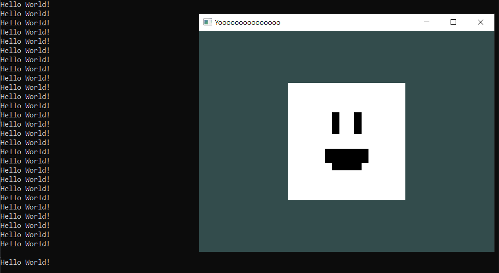
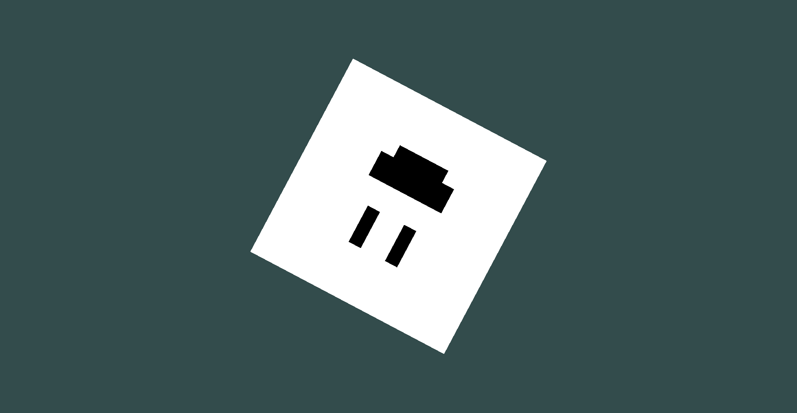
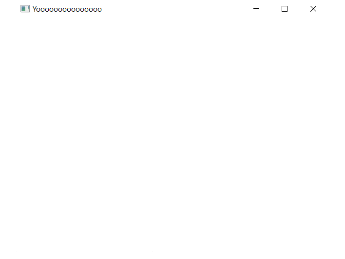
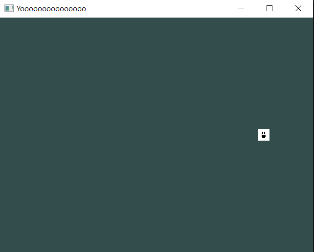

# ScriptBehaviour: Transforming Objects.

Now that you learned the basics of ScriptBehaviour, let's have some fun, shall we? :D

You're now going to learn about the "Transform" and how to manipulate it inside the Scripting API.

## What is a "Transform"?

The "Transform" is a component that all ScriptBehaviour scripts have.

This can store position, rotation, and scale data of any possible object.

For example, the "Model" and the "Draw Call" object types are a ScriptBehaviour. So the position, rotation and scale are saved inside the "Transform" component they have.

```cpp
Model* model = new Model(Model::Primitives::SQUARE, Vector3(0), Vector3(0), Vector3(1));
//													↑↑↑↑↑↑↑↑↑	↑↑↑↑↑↑↑↑↑	↑↑↑↑↑↑↑↑↑
//										These three params are added to the model's Transform component.
```

> [!TIP]
> This Scripting API allows you to add engine features aswell, just to let you know how powerful it is.

## Let's use the same setup we had last time.

But this time, our great star, Billy, is going to make a return!

**Say Hi to Billy again! :D**


This is the perfect time to combine both things that you learned into one.

We're going to combine what we learned in [Adding Textures/Images](/hello-world/adding-textures.md), and [Introducing "ScriptBehaviour"](/hello-world/introducing-scriptbehaviour.md).

*(Feel free to check both out if you have any questions or if you're stuck and don't know what to do.)*

### By combining both things, we should have this result in GameMain.h:

```cpp
#pragma once

#include "geometria.h"
#include "SquareScript.h"

struct GameMain
{
	static void Init()
	{
		Texture* t = new Texture("Game/billy.png", Texture::Type::Default);
		TextureManager::UploadToGPU();

		DrawCall* d = SceneManager::MainScene().CreateDrawCall();
		Model* model = new Model(Model::Primitives::SQUARE, Vector3(0), Vector3(0), Vector3(1));
		model->texture = t;
		model->AddScript<SquareScript>();
		RendererCore::AddModel(*model, d->Target());
	}
};
```

If we compile and open, we're gonna see effectively that Billy is constantly spamming "Hello World!".

Looks like Billy is so excited to say hello to us!



Let's use that excitement to make him spin!

## How do we make Billy spin?

Let's go back to the "SquareScript.h" and remove the "Hello World!" std::cout. Or if you're using the .h & .cpp solution, delete the "Hello World!" in "SquareScript.cpp".

In my case, i'm still using a "Header only" solution.

Now that the "OnUpdate()" void is empty, let's rotate Billy. But how do we do that? Do we need to reference it first?

And the thing is, its Transform is already referenced!

## The "GetTransform()".

The "GetTransform()" function, gets the transform of the owner of the script.

Since SquareScript is created for the model, the owner is the SquareScript is the model. So by using "GetTransform()" we get the model's Transform component without the need of a reference or adding an extra pointer to our script!

Insisde "OnUpdate()", let's add this line of code.

```cpp
GetTransform().rotation += Vector3(0, 0, 10 * Graphics::DeltaTime());
```

This is going to change the rotation of the model by constantly adding a Vector3.

In this case, we're going to do only 2D rotation, so we're only going to add the "Z" value with a speed of "10".

You see that is multiplied by `Graphics::DeltaTime()`.

## What is "Graphics::DeltaTime()"?

`Graphics::DeltaTime()` is a function that returns in form of a `float`.

This `float` is the time that passed between the last frame and the current frame, and returns it in milliseconds.

This is used to make stuff "framerate independant" most of the time.

## What is something "Framerate Independant"?

Something that has "Framerate Independency" means that no matter what framerate you have, it'll still behave the same.

If you delete the multiplication by `Graphics::DeltaTime()`, leaving only the "10" as speed, and compile it, if you have different framerates, it'll have different results.

So if you have a 60Hz monitor for example, it'll rotate slower than a 144Hz monitor, since its executing this function 144 times per second instead of 60 times per second.

To fix this, we multiply it by `Graphics::DeltaTime()` so the lower the framerate, the faster it gets. And the higher the framerate is, the slower the speed becomes. So as a result, it'll have the same outcome regardless of the FPS.

So that's why we're adding it to the rotation, so it behaves the same no matter what.

## Final Result of SquareScript (Rotation).

If you typed everything correctly, the result inside the SquareScript struct/class should look like this:

### Header only solution.

*SquareScript.h*
```cpp
... // More code.

void OnStart()
{

}
void OnUpdate()
{
	GetTransform().rotation += Vector3(0, 0, 10 * Graphics::DeltaTime());
}

... // More code.
```

### .H & .CPP solution.

*SquareScript.cpp*
```cpp
... // More code.

void SquareScript::OnStart()
{

}
void SquareScript::OnUpdate()
{
	GetTransform().rotation += Vector3(0, 0, 10 * Graphics::DeltaTime());
}

... // More code.
```

## See the output.

If you compile and open the executable, you're gonna see that Billy is spinning with joy! :D



## Let's get crazy!

Instead of rotating, let's scale instead!

Replace the `GetTransform().rotation` with `GetTransform().scale`, and scale Billy infinitely!

```cpp
void OnUpdate()
{
	GetTransform().scale += Vector3(2 * Graphics::DeltaTime(), 2 * Graphics::DeltaTime(), 0);
}
```

Since its a square and not a cube, it doesn't make sense to actually scale in the Z axis, because its not 3D.

If you compile and open, you're gonna start seeing Billy scaling and getting so big that it can't fit in the whole screen!



## Let's move Billy!

Let's replace the `GetTransform().scale` with `GetTransform().position`!

And make him move forever to the right!

```cpp
void OnUpdate()
{
	GetTransform().position += Vector3(1 * Graphics::DeltaTime(), 0, 0);
}
```

Once compiled and opened, because its "1", its gonna move very slowly to the right!

But you're probably gonna see it in a short time on camera, so in the "OnStart()", let's move him 20 units back in the world space.

```cpp
void OnStart()
{
	GetTransform().position = Vector3(0, 0, -20); // Remember the "Z" axis can move the object forward and backwards.
}
```

There's no need to add a `Graphics::DeltaTime()` since we're calling it only at the beginning of the frame.

Once we compile it, we're gonna see Billy slowly moving to the right!



## Now its up to you to combine what you learn and go crazy with it!

Go and change the position with any number and not just 1 as speed, maybe you could change it to 10, or -10, or any number.

Or change the rotation, or the scale, or combine it and rotate and scale at the same time, or scale and move at the same time.

Or maybe rotate, move and scale at the same time!

Your only limit is your imagination *(and your computers resources lol)*!

## Congrats!

You now know how to transform objects in Geometria!

Next up, you're gonna learn to **Add Input** via ScriptBehaviour! See ya there!