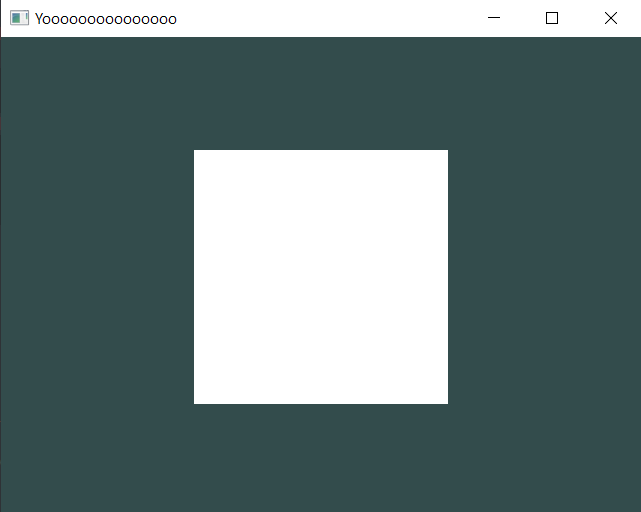

# Draw Calls & Your first Square.

## Get a look at your default set up.

In the last "Hello World" Tutorial, you can see that your game/app is just a window with a "dark cyan" background.


So in this section, you're going to learn how to make a simple square.

But in order to render things in here, you need to learn a concept that in most engines is kept hidden.

What i'm going to talk about is the **"Draw Call"**.

## What is a Draw Call?

A Draw Call is the instruction you send from the CPU to the GPU. This instruction is going to tell the GPU what it has to draw.
This is used everywhere in game engines for drawing anything you see on screen from simple meshes, to complex scenarios.

Some game engines allow you to use them, but to a little extent...

### Why engines don't let you use them a lot?

Usually its because of automation. 

They don't want you to worry about them, but in the long run sometimes the system that handles the entire rendering engine tends to mess stuff up in specific situations without you being able to fix them.

### So what does Geometria does instead?

This engine does a full 180°, by being able to control Draw Calls as normal objects in the scene.
So by default you have complete control over the Rendering Engine.

This comes with the sacrifice of not enough automation, but the API is prepared to make your life much easier, so you're not thrown away to the wilderness.

Don't worry, this is not gonna be overhwelming, in fact, its much easier than you might think!

## Adding a simple Square.

Let's start by creating a Draw Call into the Init() void:

> [!TIP]
> Every object you add has to be a pointer, otherwise it'll either give you an error or straight up crash.

```cpp
static void Init()
{
    DrawCall* d = SceneManager::MainScene().CreateDrawCall();
}
```

This line of code is going to create a Draw Call in our current Scene.

Then, in the next line of code, we add what its called a **Model**.

### What is a Model?

A model is basically an object that is going to be displayed.
That can be from a square or a triangle, to a cube, to a big city, to any shape or form you want to add.

We're going to add a model by adding this next line of code.

```cpp
Model* model = new Model(Model::Primitives::SQUARE, Vector3(0, 0, 0), Vector3(0, 0, 0), Vector3(1, 1, 1));
```

This piece of code is going to instantiate a model, with these parameters:
- The shape of the Model, in this case the shape is a **Square**.
- A **Vector** that sets model's **position** in the world.
- A **Vector** that sets model's **rotation**.
- A **Vector** that sets model's **size**/**scale**.

And once we finish instantiating the model, we need to add it to the draw call.

### How you add a model to a draw call?

You do it by adding this function:

```cpp
RendererCore::AddModel(*model, d->Target());
```

The "RendererCore::AddModel()" is going to use the model we created earlier, and add it into the Draw Call we made before (in this case we called it "d").

The whole **GameMain.h** code should look like this now:

```cpp
#pragma once

#include "geometria.h"

struct GameMain
{
    static void Init()
    {
        DrawCall* d = SceneManager::MainScene().CreateDrawCall();
        Model* model = new Model(Model::Primitives::SQUARE, Vector3(0, 0, 0), Vector3(0, 0, 0), Vector3(1, 1, 1));
        RendererCore::AddModel(*model, d->Target());
    }
};
```

## Final Result.

After you save everything and compile (remember that every time you change something, you need to compile your project again), and open the executable, it should display the square in the middle of the screen.



If you see this then congratulations! You just instantiated your first square!

Now next up in this tutorial series is [Draw Call Batching](/hello-world/draw-call-batching.md).