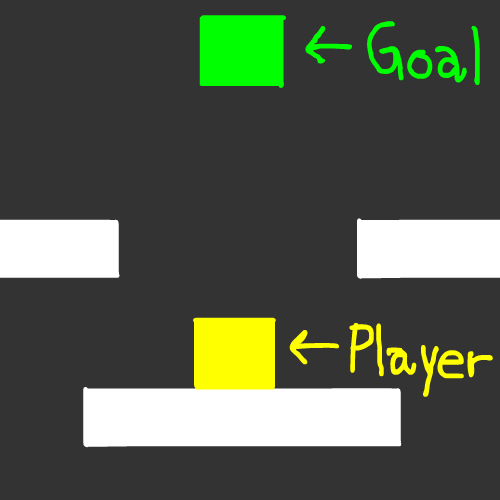
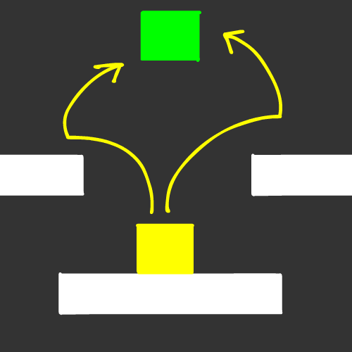
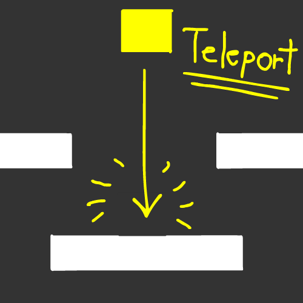

# Bundle Up Everything

Hello! Welcome to the last chapter of this wonderful Physics tutorial!

Now its time to bundle everything and turn it into a **game**!

We're going to do... **A 2D PLATFORMER** as our final excercise! :D

Don't worry, its not going to be hard at all, in fact, you already coded **80%** of what its needed thanks to these tutorials!

**Let's get started**! :D

## The Plan

So, the Plan basically is to make a simple platformer, that has the **yellow player**, **a green goal** and of course, some platforms.



The objetive is quite simple: Move and jump to one of the other platforms and reach the goal.



And once the player hits the goal, it'll teleport back to its origin.



**Quite simple! :D**

## Let's get coding!

First, let's modify and add new functionality to our player!

### Modifying and adding more Inputs.

Let's go to the Player script...

For this we're going to implement a code so A & D will make the player move left and right, and SPACE will make the player jump.

So, to move the player, we're going to apply the knowledge we gathered in the "Velocity Manipulation" chapter, and use it to move the player left and right.

Now, inside the ```OnUpdate()``` function of the Player struct, and with ```Input::GetKey()``` we can check if the "A" key or the "D" key are pressed.

And if that condition is met, we set the Velocity of the X axis. Positive speed by pressing "D", negative speed by pressing "A"...

In this case, i'm gonna try and set the movement speed to "250" (and to "-250", in the "A" key press condition) and multiply both speeds by ```Graphics::DeltaTime()``` to make the movement framerate independant.

I know its a *bit* of a big number, but when dealing with forces, you usually use big numbers in general.

For the sake of not only optimizing but also cleaning up my code a bit, i'm going to store the [Rigidbody](/api/Physics/Rigidbody.md) component in a pointer and get the script in ```OnStart()```, but feel free to use the quick ```GetScript<>()``` approach, its up to you:

```cpp
... // Top code

struct Player : public ScriptBehaviour
{
	Rigidbody* rb = nullptr;

	... // More code

	void OnStart()
	{
		rb = GetScript<Rigidbody>();

	... // More code

	void OnUpdate()
	{
		if(Input::GetKey(GLFW_KEY_A))
		{
			rb->SetVelocity(Vector3(-250 * Graphics::DeltaTime(), rb->GetVelocity().y, 0));
		}
	
		if(Input::GetKey(GLFW_KEY_D))
		{
			rb->SetVelocity(Vector3(250 * Graphics::DeltaTime(), rb->GetVelocity().y, 0));
		}
	
... // Bottom code
```

But hey! There's this new function called ```GetVelocity()```, what is it and why are we using it?

### What is GetVelocity()?

```GetVelocity()``` is a function that is part of the [Rigidbody](/api/Physics/Rigidbody.md) script, which allows you to get the current velocity of the dynamic object.

### Why are we using GetVelocity() in this case?

**We're doing it to keep our momentum in the rest of the axes.**

If we set the velocity to ```Vector3(1, 0, 0)```, the X axis is going to move correctly.

**But if we're jumping or in the air, the Y axis is going to stop moving the moment we hit one of our left and right keys.**

So we use ```rb->GetVelocity().y```, or if you're doing the quick approach ```GetScript<Rigidbody>()->GetVelocity().y``` to store the speed of the Y axis and keep our vertical momentum intact while moving left and right.

Now, for the final piece...

### Let's modify the Jump mechanic.

In our last "Velocity Manipulation" tutorial, we still used the "R" key to do a jump.

First let's change "R" to "SPACE", and use the ```GetVelocity()``` to maintain the left & right momentum while jumping.

```cpp
if(Input::GetKeyDown(GLFW_KEY_SPACE))
{
	RaycastBuffer rBuffer;
	rBuffer.DiscardTriggers(true);
	PhysicsManager::Raycast(GetTransform().position, Vector3::down(), 1, rBuffer);

	if(rBuffer.HitAnythingExcept(GetScript<BoxCollider>()))
	{
		rb->SetVelocity(Vector3(rb->GetVelocity().x, 10, 0));
	}
}
```

### 1st Result.

If we compile and run it, we're gonna see that the player not only jumps when we press SPACE, but also can move left and right with A and D.


### Code it to whatever fits you best.

If you move left and right, you're gonna see that the current implementation is extremely physics-based.

For some games this is a neat detail since the player slides a bit before it ends, and also keeps its horizontal momentum while jumping.

But probably isn't snappy enough for you, **which is extremely fine** by the way! :D

Some games want a more "quick response" to horizontal movement that basically **stops** the moment the A and/or D keys are no longer pressed.

An alternative to this is to discard the ```SetVelocity()``` implementation for horizontal movement and use ```GetRigidbodyTransform()``` instead, leaving ```SetVelocity()``` for only jumping.

```cpp
if(Input::GetKey(GLFW_KEY_A))
{
	rb->GetRigidbodyTransform().position -= Vector3(1 * Graphics::DeltaTime(), 0, 0);
}

if(Input::GetKey(GLFW_KEY_D))
{
	rb->GetRigidbodyTransform().position += Vector3(1 * Graphics::DeltaTime(), 0, 0);
}
```

```GetVelocity()``` is not needed anymore since we're **adding** or **subtracting** rather than **setting** the values.

And you're gonna need to change the speed to something *way* much smaller since we're not moving around forces anymore.