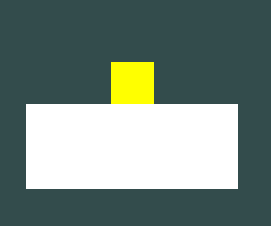

# Bundle Up Everything

Hello! Welcome to the last chapter of this wonderful Physics tutorial!

Now its time to bundle everything and turn it into a **game**!

We're going to do... **A 2D PLATFORMER** as our final excercise! :D

Don't worry, its not going to be hard at all, in fact, you already coded **80%** of what its needed thanks to these tutorials!

**Let's get started**! :D

## The Plan

So, the Plan basically is to make a simple platformer, that has the **yellow player**, **a green goal** and of course, some platforms.


The objetive is quite simple: Move and jump to one of the other platforms and reach the goal.


And once the player hits the goal, it'll teleport back to its origin.


**Quite simple! :D**

## Let's get coding!

First, let's modify and add new functionality to our player!

### Modifying and adding more Inputs.

Let's go to the Player script...

For this we're going to implement a code so A & D will make the player move left and right, and SPACE will make the player jump.

So, to move the player, we're going to apply the knowledge we gathered in the "Velocity Manipulation" chapter, and use it to move the player left and right.

Now, inside the ```OnUpdate()``` function of the Player struct, and with ```Input::GetKey()``` we can check if the "A" key or the "D" key are pressed.

And if that condition is met, we set the Velocity of the X axis. Positive speed by pressing "D", negative speed by pressing "A"...

In this case, i'm gonna try and set the movement speed to "250" (and to "-250", in the "A" key press condition) and multiply both speeds by ```Graphics::DeltaTime()``` to make the movement framerate independant.

I know its a *bit* of a big number, but when dealing with forces, you usually use big numbers in general.

For the sake of not only optimizing but also cleaning up my code a bit, i'm going to store the [Rigidbody](/api/Physics/Rigidbody.md) component in a pointer and get the script in ```OnStart()```, but feel free to use the quick ```GetScript<>()``` approach, its up to you:

```cpp
... // Top code

struct Player : public ScriptBehaviour
{
	Rigidbody* rb = nullptr;

	... // More code

	void OnStart()
	{
		rb = GetScript<Rigidbody>();

	... // More code

	void OnUpdate()
	{
		if(Input::GetKey(GLFW_KEY_A))
		{
			rb->SetVelocity(Vector3(-250 * Graphics::DeltaTime(), rb->GetVelocity().y, 0));
		}
	
		if(Input::GetKey(GLFW_KEY_D))
		{
			rb->SetVelocity(Vector3(250 * Graphics::DeltaTime(), rb->GetVelocity().y, 0));
		}
	
... // Bottom code
```

But hey! There's this new function called ```GetVelocity()```, what is it and why are we using it?

### What is GetVelocity()?

```GetVelocity()``` is a function that is part of the [Rigidbody](/api/Physics/Rigidbody.md) script, which allows you to get the current velocity of the dynamic object.

### Why are we using GetVelocity() in this case?

**We're doing it to keep our momentum in the rest of the axes.**

If we set the velocity to ```Vector3(1, 0, 0)```, the X axis is going to move correctly.

**But if we're jumping or in the air, the Y axis is going to stop moving the moment we hit one of our left and right keys.**

So we use ```rb->GetVelocity().y```, or if you're doing the quick approach ```GetScript<Rigidbody>()->GetVelocity().y``` to store the speed of the Y axis and keep our vertical momentum intact while moving left and right.

Now, for the final piece...

### Let's modify the Jump mechanic.

In our last "Velocity Manipulation" tutorial, we still used the "R" key to do a jump.

First let's change "R" to "SPACE", and use the ```GetVelocity()``` to maintain the left & right momentum while jumping.

```cpp
if(Input::GetKeyDown(GLFW_KEY_SPACE))
{
	RaycastBuffer rBuffer;
	rBuffer.DiscardTriggers(true);
	PhysicsManager::Raycast(GetTransform().position, Vector3::down(), 1, rBuffer);

	if(rBuffer.HitAnythingExcept(GetScript<BoxCollider>()))
	{
		rb->SetVelocity(Vector3(rb->GetVelocity().x, 10, 0));
	}
}
```

### 1st Result.

If we compile and run it, we're gonna see that the player not only jumps when we press SPACE, but also can move left and right with A and D.




### Code it to whatever fits you best.

Probably you want the player to stop once it finishes moving from left to right, or maybe its not fast enough for you...

Well, you can make those changes too!

Try changing the speed to 300 instead of 250!

```cpp
if(Input::GetKey(GLFW_KEY_A))
{
	rb->SetVelocity(Vector3(-300 * Graphics::DeltaTime(), rb->GetVelocity().y, 0));
}

if(Input::GetKey(GLFW_KEY_D))
{
	rb->SetVelocity(Vector3(300 * Graphics::DeltaTime(), rb->GetVelocity().y, 0));
}
```

Or if you want the horizontal momentum to stop once i stop pressing the A and D keys.

```cpp
if(!Input::GetKey(GLFW_KEY_A) && !Input::GetKey(GLFW_KEY_D))
{
	rb->SetVelocity(Vector3(0, rb->GetVelocity().y, 0));
}
```

Or add an automatic jump so you can hold SPACE and it'll auto-jump again the moment it touches the floor, by changing ```Input::GetKeyDown()``` to ```Input::GetKey()```.

```cpp
if(Input::GetKey(GLFW_KEY_SPACE))
{
	... // The rest of the code
}
```

**Its up to you to code it what you want! :D**

For this case i'm going to apply all of these three changes, but again, feel free to experiment with it, and come back once you finished coding the perfect functionality you're looking for :)

Now that you're back from experimenting with the moveset...

### Let's code the goal.

Since the goal is going to be on top, we're going to:

- Change its color to green.
- Set its size to (1, 1, 1).
- Move it a bit up.

In the GameMain.h file...

```cpp
Model* trigger = new Model(Model::Primitives::SQUARE, Vector3(0, 5, -10.1), Vector3(0), Vector3(1, 1, 1));
trigger->color = Color::green();
```

Now, let's go to our "ColorTrigger" script, and code it so instead of changing the color of the player, it teleports it back to its spawn point.

```cpp
void OnTriggerEnter(ScriptBehaviour& hit)
{
	if(hit.GetScript<Player>() != nullptr)
	{
		hit.GetScript<Rigidbody>()->GetRigidbodyTransform().position = Vector3(0, 2, -10);
	}
}
```

### 2nd Result.

If we compile and run it, you can see the goal up there clearly! :D


### Now, the final touch...

Turn this into a fun little challange!

First, let's lower down the floor a bit to something like (0, -4, -10):

```cpp
Model* floor = new Model(Model::Primitives::SQUARE, Vector3(0, -4, -10), Vector3(0), Vector3(5, 2, 1));
```

And lower down the player aswell, how about (0, 0, -10)?

```cpp
Model* rigidBody = new Model(Model::Primitives::SQUARE, Vector3(0, 0, -10), Vector3(0), Vector3(1));
```

### 3rd Result.

Now if we compile and run it again...

**NOW THAT'S MORE LIKE IT!**


Now the square is lower, therefor it can't reach the goal by just jumping.

Now, for the last step, let's add some plaforms!

In this case i'll set the first platform's position to (-6, 0, -10), and the second one to (6, 0, -10) so the player can have a choice if it wants to go left or right.

```cpp
Model* floor2 = new Model(Model::Primitives::SQUARE, Vector3(-6, 0, -10), Vector3(0), Vector3(5, 2, 1));
Model* floor3 = new Model(Model::Primitives::SQUARE, Vector3(6, 0, -10), Vector3(0), Vector3(5, 2, 1));

floor2->AddScript<BoxCollider>();
floor3->AddScript<BoxCollider>();
```

And finally add both to the Draw Call:

```cpp
RendererCore::AddModel(*floor2, d->Target());
RendererCore::AddModel(*floor3, d->Target());
```

### Final Result.

If we compile and run once again, you're gonna see that the platformer works!


Feel free to enjoy your final result!


## Congratulations!

**You successfully completed the PHYSICS Tutorial! :D**

***Fantastic Job!***

**You sucessfully learned about Collisions, Dynamic Bodies, Raycasting, Triggers and Manipulation of Forces!**

Hope you enjoyed it a lot! :D

Now you can feel free to look around for other tutorials!

### Special Thanks (as NachoBIT):

I want to thank **Guigui** and **The Seg Fault** for helping me a lot with grammar issues and ideas, you guys are the best :D.