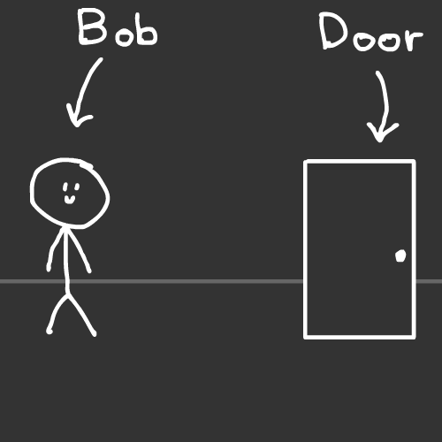
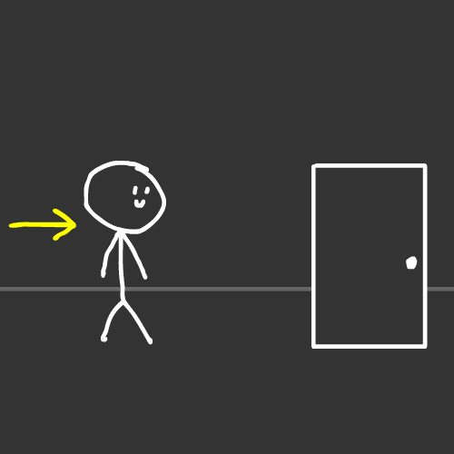
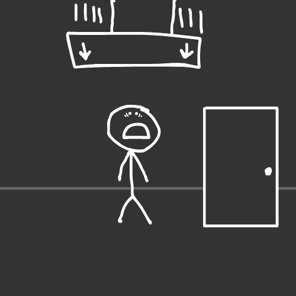
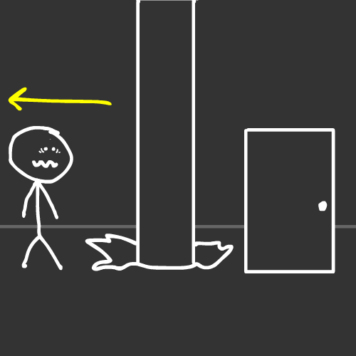
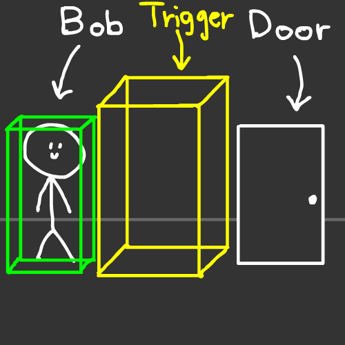
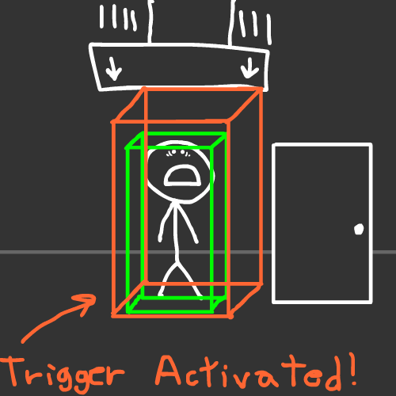
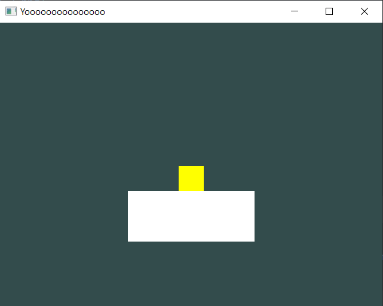
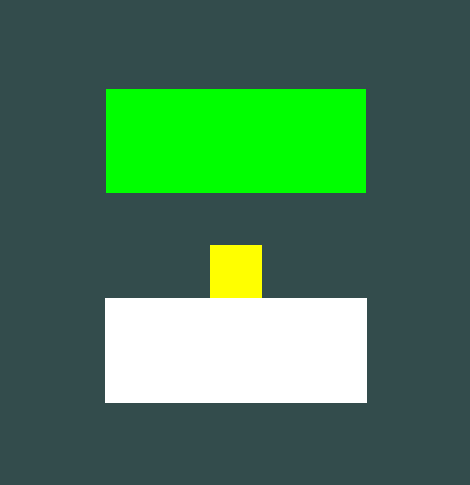
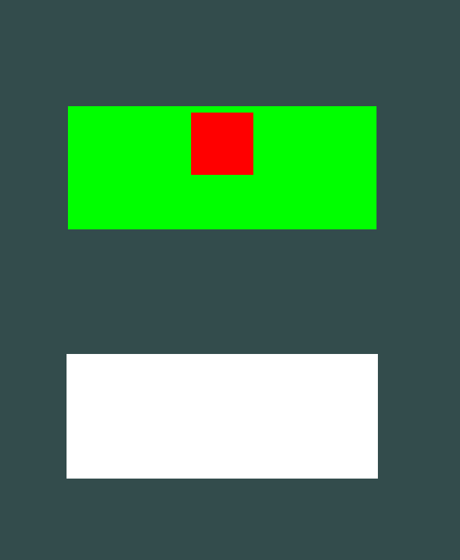

# Introducing Triggers

Welcome to a new chapter of the Physics tutorial!

This time, we're going to take a look at **Triggers**!

You *might* be asking yourself...

## What is a Trigger?

Well, a Trigger is basically a collision detection object, with the sole purpose of checking if other collisions are inside it.

**Other objects can't collide with it, therefore it merely detects an overlap of objects**.

***But...*** it can act as an invisible activator, like an invisible cube that opens a door, or something that activates a trap!

## Let's see a situation in form of a comic!

**This is "Bob", say hi to Bob! :D**. **Bob** needs to go through the door, because he needs to go to work:



Bob, walks to the door...



When all of the sudden... **A BIG TRAP IS ACTIVATED! 20 TONS OF STEEL COMING STRAIGHT TO BOB'S BODY!!!**

**LOOK OUT BOB!**





***Phew...*** that was a close one!

Thank god Bob is safe :)

## But what caused this situation to happen?

Well, let's go back to the 1st panel and make all collision objects & triggers visible:



**A-ha!** There was an invisible trigger in there!

So when Bob walked to the middle, he activated it causing it to make a trap fall!



**So this is basically the power of triggers, showed visually!**

You can use this method to activate or execute anything you want by just checking for a collision!

So, now that we went through this...

## Let's get back to coding!

Go back to the scene we made in the last chapter...

First, let's push both the floor and the rigidbody a bit further, and set the rigidbody's Y position a bit higher:

```cpp
Model* floor = new Model(Model::Primitives::SQUARE, Vector3(0, -2, -10), Vector3(0), Vector3(5, 2, 1));
Model* rigidBody = new Model(Model::Primitives::SQUARE, Vector3(0, 4, -10), Vector3(0), Vector3(1));
```

And remember in the script we made earlier (*in the last tutorial, it was called the "Player" script*), we need to change the origin aswell:

```cpp
if(rBuffer.HittedAnythingExcept(GetScript<BoxCollider>()))
{
	GetScript<Rigidbody>()->GetRigidbodyTransform().position = Vector3(0, 4, -10);
}
```

Great! Now if we compile and run, the scene is going to have much more space, which is great for our trigger implementation:



## Now, let's add the Trigger!

To demonstrate it a bit visually, we're going to use a "Model" instead to see where the trigger is going to be:

- First, we add it in the scene and change its initial color to green:

 	```cpp
 	 Model* trigger = new Model(Model::Primitives::SQUARE, Vector3(0, 2, -10.1), Vector3(0), Vector3(5, 2, 1));
	  trigger->color = Color::green();
 	```

- Second, add a Rigidbody and a Box Collider, and use the ```SetTrigger()``` function to change it from a normal collision, to a trigger, this by adding a boolean parameter, which in this case is going to be "true":

 	```cpp
 	 trigger->AddScript<Rigidbody>();
	  BoxCollider* triggerBC = trigger->AddScript<BoxCollider>();
	  triggerBC->SetTrigger(true);
 	```

 	To prevent using the ```GetScript<>()``` and save the engine from having to look for it, we save it in a pointer. But you can do this other implementation, which is much quicker, whatever fits best for you:

 	```cpp
 	 trigger->AddScript<Rigidbody>();
	  trigger->AddScript<BoxCollider>();
	  trigger->GetScript<BoxCollider>()->SetTrigger(true);
 	```

- And finally, for visual purposes, we send the trigger model to our Main Draw Call:

 	```cpp
	 RendererCore::AddModel(*trigger, d->Target());
 	```

### Why do we need to set a Rigidbody if the Trigger is not going to move?

Because Triggers ***HAVE*** to be dynamic in order to work.

Triggers need to constantly look if something touches it/its inside of the trigger, even if it is a Rigidbody or isn't, which is something a static model can't do on its own (*atleast not internally*).

## 1st Result.

If we compile and run it, you're gonna see this scene:



And if we press "R", you can see that it goes through the trigger successfully!

## But... a wild issue appears!

You can see that if we're inside the Trigger, we can still teleport back up, meaning that **the RaycastBuffer thinks the Trigger is a type of floor**.

**So how do we fix this?**

## Introducing "DiscardTriggers()"

The "DiscardTriggers()" function which is part of the Raycast Buffer, can set if you want to discard all triggers it touches, or not if you want to do further analysis.

In this case, we don't want to check or analyze them, so let's use this function to completely disable trigger detection.

**So let's go to our "Player" script...**

And between the RaycastBuffer object initialization and the Raycast, we add the function.

```cpp
RaycastBuffer rBuffer;
rBuffer.DiscardTriggers(true);
PhysicsManager::Raycast(GetTransform().position, Vector3::down(), 1, rBuffer);
```

This will basically set that instruction before it does the Raycast, if you do this after its not going to take effect unless you launch the Raycast again.

## 2nd Result.

If we compile and run it, you can see clearly that when i press "R" inside the Trigger, its not going to teleport the Rigidbody to the top.

**Problem Solved! YAY! :D**

## Now, let's make the Trigger do something...

What if we want to change the color of the Rigidbody when enters the trigger, and when it exits the triggers goes back to its original color?

**YES, Let's do that! :D... But how?**

Well, first we need to add a functionality to the trigger object, so to get started, let's make another script!

**For this tutorial i'll make a new "Trigger.h" file.**

In this tutorial, i'm going to add it in the same directory the "GameMain.h" is currently in, but again, feel free to put it anywhere as long as it doesn't leave the "Game" environment.

Inside this "Trigger.h", and add a "ColorTrigger" ScriptBehaviour struct inside of it.

*Trigger.h*

```cpp
#ifndef GAME_TRIGGER_H
#define GAME_TRIGGER_H

struct ColorTrigger : public ScriptBehaviour
{

}; // Remember to add a ";"" at the end.

#endif
```

And now, let me introduce two void functions that will help you with this:

## Introducing "OnTriggerEnter()" and "OnTriggerExit()"

These two functions that are part of the ScriptBehaviour are going to help us with the trigger's overall functionality.

You add them like this:

```cpp
#ifndef GAME_TRIGGER_H
#define GAME_TRIGGER_H

#include "geometria.h"
#include "geometria/physics.h"

struct ColorTrigger : public ScriptBehaviour
{
	void OnTriggerEnter(ScriptBehaviour& hit)
	{

	}

	void OnTriggerExit(ScriptBehaviour& hit)
	{

	}
}; // Remember to add a ";"" at the end.

#endif
```

> [!TIP]
> Remember to add ```(ScriptBehaviour& hit)``` inside of the parenthesis of both functions, otherwise it'll not work.

```OnTriggerEnter(ScriptBehaviour& hit)``` is going to execute the moment a collider is inside of the trigger, and the "hit" parameter is going to contain the information about that object that entered the trigger's space.

So, with that beind said, let's go and code what happens when an object is inside the trigger:

Since "hit" can be *any* object that has a collider, let's check if its actually the Rigidbody, we can do it by checking if getting the script we made for the Rigidbody is not a "null pointer", or ```nullptr```.

In the tutorial's end, remember that its called "Player":

```cpp
void OnTriggerEnter(ScriptBehaviour& hit)
{
	if(hit.GetScript<Player>() != nullptr)
	{

	}
}
```

Now let's code that if the condition is true, meaning that there is a Player script, we can get the Model component and change its color.

Let's change it to something like **RED**, for example.

```cpp
void OnTriggerEnter(ScriptBehaviour& hit)
{
	if(hit.GetScript<Player>() != nullptr)
	{
		hit.GetScript<Model>()->color = Color::red();
	}
}
```

Since we know the player **contains** a Model component, we don't have any problem doing a quick approach, although if you wanna make 100% sure that it has a component so it doesn't crash, you can do something similar to this:

```cpp
if(hit.GetScript<Player>() != nullptr)
{
	Model* getModel = hit.GetScript<Model>();
	if(getModel != nullptr)
	{
		getModel->color = Color::red();
	}
}
```

Feel free to code any option you want since both examples are completely valid :)

**Nice! We finished coding the ```OnTriggerEnter()``` function**

Now the only thing missing is to add functionality inside of the ```OnTriggerExit()```.

```OnTriggerEnter(ScriptBehaviour& hit)``` is going to execute the moment an object **exits** the trigger, which is basically the opposite of ```OnTriggerEnter()```.

You basically do the exact same thing, but the only thing you change is the color of the Model, since in this case we want it to go back to its original **YELLOW** color.

So its pretty much a "copy-paste" with little modifications:

```cpp
void OnTriggerExit(ScriptBehaviour& hit)
{
	if(hit.GetScript<Player>() != nullptr)
	{
		hit.GetScript<Model>()->color = Color::yellow();
	}
}
```

**Aaaaaand done! We coded the Trigger! :D**

## Final Touches.

So now, let's head back to GameMain.h...

Include the Trigger header file we just did:

```cpp
#pragma once

#include "geometria.h"
#include "geometria/physics.h"

#include "Player.h"
#include "Trigger.h"
```

> [!TIP]
> Remember that in this tutorial, i added it in the same directory as "GameMain.h", so if you added it in a Game sub-folder that you created, make sure to add that path instead.

And once we included it, we add the script to the Trigger object.

In this tutorial, i called it "ColorTrigger":

```cpp
trigger->AddScript<Rigidbody>();
BoxCollider* triggerBC = trigger->AddScript<BoxCollider>();
triggerBC->SetTrigger(true);

trigger->AddScript<ColorTrigger>();
```

## Final Result.

Now... its time to see the **final results**!

If we compile and run it, we're gonna see our nice yellow square:


**But if we teleport it by pressing "R"**

We're gonna see that the moment the square gets inside of the trigger...

**IT TURNS RED! :D**



And once it leaves the trigger, it turns back to yellow!

## Congratulations!

You made it :D! You now know the basics of Triggers!

If you want as a **little bonus**, feel free to go back to "GameMain.h" and make the trigger Model transparent!

```cpp
Model* trigger = new Model(Model::Primitives::SQUARE, Vector3(0, 2, -10.1), Vector3(0), Vector3(5, 2, 1));
trigger->color = Color(0, 0, 0, 0);
```

If you compile and run it again, you're gonna see that the trigger is completely invisible! :D


So that's it for this chapter! Hope you enjoyed it!

**The Next one** is about [**Velocity Manipulation**](/physics/velocity-manipulation.md)! See you there! :D