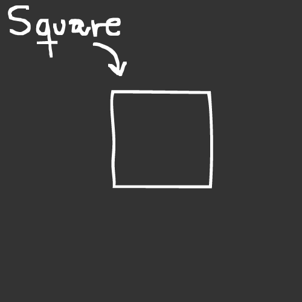
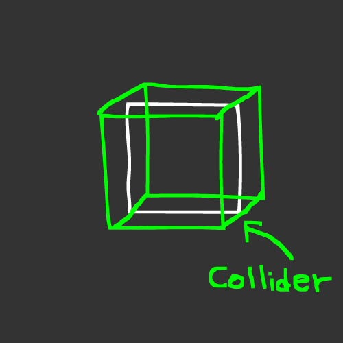
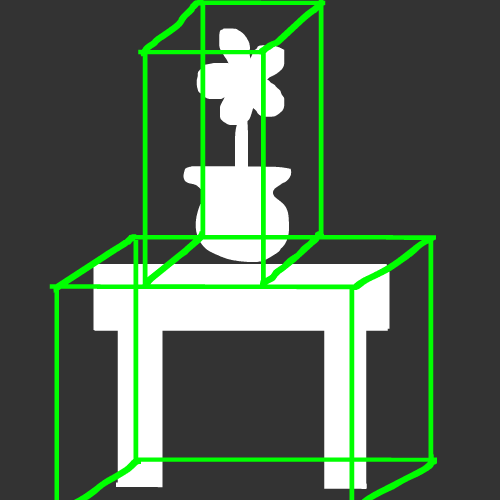

# Introduction to Physics.

Welcome to the second tutorial of the engine's documentation!

In here you're going to learn about physics, and at the final chapter you're gonna be able to make your first "platformer character movement"!

But first, let's take a closer look at the basics and start slowly before jumping to the end. Don't worry! This will be pretty straight-forward like the "Hello World" tutorial!

## Introducing the components.

When it comes to Physics, we have **two key components** that are extremely useful, the [**Rigidbody**](/api/Physics/Rigidbody.md) and the **Collisions**.

The most basic one of them all is the [**BoxCollider**](/api/Physics/BoxCollider.md), so let's start from there.

## What is the Box Collider?

The Box Collider is basically an invisible box that is going to be used for overall collisions. If you play a lot of games, you're gonna see sometimes some furtniture or a player that has something similar, this is because of two reasons:

- First, its the most basic shape of them all.
- Second, because of the first reason, its much easier to compute in the background.

Let me demonstrate in detail, with basic drawings!

Let's imagine the basic scene with a square, like in the previous tutorials.



And as a game developer, i want this to be interactable with the physics world. That's where the Box Collider (or any kind of collider) comes into play.

By adding this component, the model becomes part of the physics world.

*(The Green Lines showed in there are actually invisible, its just to give a representation of the physical object's shape)*



Now, this object can interact with anything related to physics, like objects falling from the sky, bullets shooting straight to it, objects being on top of it, etcetera.

Since it doesn't have anything other than the Box Collider, this becomes a static model in this physics world. This means that its not affected to gravity, it becomes completely solid, so it can make different roles such as:

- An immovable object.
- A floor.
- Simple furniture like a little table.
- And more stuff!

Let's see another example: We have two objects, one being a table, and the other one being a flower inside a vase. Both objects being internally, models with a texture on them.


If we want to get them into the physical world as static objects, we simply create two Box Collider scripts, one for each object!



Now that i told you all of this.

## Let's put it to the test...

Let's go back to GameMain.h, and set up a basic scene:

```cpp
static void Init()
{
    DrawCall* d = SceneManager::MainScene().CreateDrawCall();
    Model* model = new Model(Model::Primitives::SQUARE, Vector3(0, 0, 0), Vector3(0, 0, 0), Vector3(1, 1, 1));
    RendererCore::AddModel(*model, d->Target());
}
```

**Remember when we made our first script?**

Well, since the BoxCollider is a ScriptBehaviour component, to add it to our model, we simply use ```AddScript<>()```!

```cpp
model->AddScript<BoxCollider>();
```

And if we compile and run it, well, nothing happens... But the object is now part of the physics world! :D

