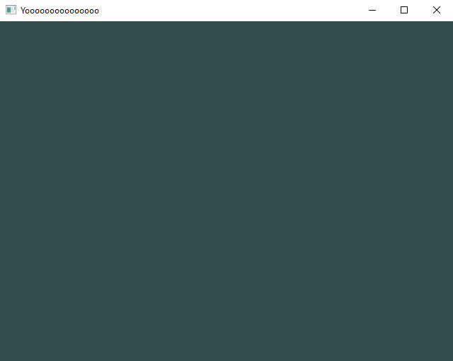
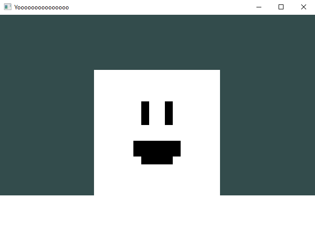
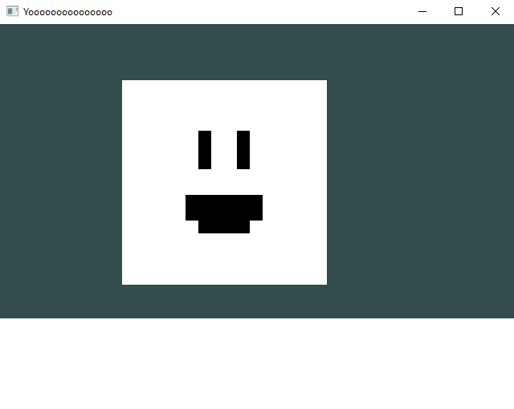

# Physics in Geometria

## Welcome to the second tutorial of Geometria!

Now, we're gonna learn how to add physics to your game!

Physics reside on mainly **two** built-in scripts, that you can directly import in your `GameMain.h` by typing in `#include "geometria/physics.h"` before the `struct GameMain`, called `BoxCollider` and `Rigidbody`.

The first one, `BoxCollider`, is self-explanatory. It defines a box hitbox around your model. Every model that needs an hitbox *needs* this script.<br/>
To demonstrate how this works, we need to introduce another script, `Rigidbody`.<br/>
`Rigidbody` will basically add gravity to the object it is attached to. It needs a BoxCollider to properly function, otherwise your model would just fall through the ground.

## So, we have two new scripts to use, how do we use them?
First up, let's bring back our project from [our previous tutorial](/hello-world/hello-world.md), which may look something like this:

```text
.
├── Game
|	├── GameMain.h
|   ├── SquareScript.h
|   ├── SquareScript.cpp (optional)
|	├── billy.png
|	└── ...
└── ...
```

Open the `GameMain.h`, and like mentioned a bit more above, add `#include "geometria/physics.h"` below the include of geometria and your ScriptBehaviour.<br/>
And now, before adding the `SquareScript`, add two lines like this: <br/>
```cpp
        ...
        model->AddScript<BoxCollider>();
        model->AddScript<Rigidbody>();
        ...
```
<br/>
These two lines will add the needed scripts for physics to work on our good ol' friend Billy. Let's compile and see what happens.

> [!TIP|style:flat|label:REMINDER]
> To compile your project, open your local command prompt in the root folder of your project, and type `geo --compile` (or, if using powershell, `.\geo.exe --compile`)



## Where did Billy go? :(

Fairly simple, he's falling, far out of reach for us to find out where he is... Let's fix that!<br/>
To do that, we need to add another object to the scene, let's add a rectangle for example!<br/>
```cpp
        ... // Above is the Billy initialisation

        //Platform setup
        Model* platform = new Model(Model::Primitives::SQUARE, Vector3(0,-1, 0), Vector3(0), Vector3(3,1,1));
        platform->AddScript<BoxCollider>();

        //Add platform to our draw call
        RendererCore::AddModel(*platform, d->Target());
```

Now, if you re-compile the game, you should see our good ol' friend Billy standing on the newly created platform!



Now, let's move around...


Looks like it's not working as expected...

## Applying Velocity

We just need to change our way of moving Billy! We used to change `GetTransform().position`, but it seems like it doesn't behave the same way anymore.<br/>

**Q: What causes that?**

It's the `RigidBody` that's taking over the position, so to change it, you just need to reference your local RigidBody class, by first creating a variable:<br/>
```cpp
struct SquareScript : public ScriptBehaviour
{
    ... (other variables)
    Rigidbody* r; //THIS is what you need to add

    ... (OnStart and stuff)
}
```
And then defining it in the `OnStart()` function with the following:
```cpp
    void OnStart()
    {
        r = GetScript<Rigidbody>();
    }
```
> [!TIP|label:INFO]
> `GetScript<...>();` allows you to get any script, as long as the object has the script you're asking for.
> If there's no script with that name on your object, it will return `nullptr`, so it's better to check if the script is present by a `if(r != nullptr)` before your actions on the script.

And then, once you got everything ready, let me introduce you to `r->SetVelocity();`.

This function will simply set the current velocity of the Rigidbody to whatever `Vector3` you want.

So how do we implement it inside our script? Easy! Simply change our old `GetTransform().position += ` something to our new `r->SetVelocity();`, that leads to something like this:

```cpp
    void OnUpdate()
    {
        if(Input::GetKey(GLFW_KEY_W))
            r->SetVelocity(Vector3(r->GetVelocity().x, speed, 0)); // Move up.
        if(Input::GetKey(GLFW_KEY_S))
            r->SetVelocity(Vector3(r->GetVelocity().x, -speed, 0));// Move down.
        if(Input::GetKey(GLFW_KEY_A))
            r->SetVelocity(Vector3(speed, r->GetVelocity().y, 0));// Move left.
        if(Input::GetKey(GLFW_KEY_D))
            r->SetVelocity(Vector3(-speed, r->GetVelocity().y, 0));// Move right.
    }
```

And, *voilà!* Now Billy can move freely in this new 2D space!

TODO: ADD IMAGE HERE

> [!TIP]
> To put the camera far back and see the whole scene better, simply add `Graphics::MainCamera()->GetTransform().position = Vector3(0,0,15);` to `GameMain.h` to move the camera 15 units away from the scene.

But now, how do we change the position? Like, if we need to teleport the player, or something. Simple! Instead of `GetTransform()`, use `r->GetRigidbodyTransform()`

So for example, to teleport Billy back at the origin:
```cpp
    r->GetRigidbodyTransform().transform = Vector3(0);
```

We can implement this on a Reset key, like R, which will just put Billy out of the void very nicely, like this!
```cpp
        if(Input::GetKey(GLFW_KEY_R))
            r->GetRigidbodyTransform().transform = Vector3(0);
```

One small issue you may have noticed is that Billy does not directly stop upon lifting the key and continues a bit in the direction you were pressing. To fix that, simply implement a check to see if none of the keys are pressed and fix the velocity accordingly:

```cpp
    if(!Input::GetKey(GLFW_KEY_W) && !Input::GetKey(GLFW_KEY_S))
        r->SetVelocity(Vector3(r->GetVelocity().x, 0, 0)); // Cancels Y Velocity
    if(!Input::GetKey(GLFW_KEY_A) && !Input::GetKey(GLFW_KEY_D))
        r->SetVelocity(Vector3(0, r->GetVelocity().y, 0));// Cancels X Velocity
```

You may notice the Y velocity gets canceled by the first lines of the chunk of code above. You can, if you want, remove it and instead let the gravity act on the player!

## Restrain Axes

If you play with these new scripts, you may notice that sometimes, Billy may straight up clip through the ground. This is due to Billy actually slightly tilting towards the Z-axis. We can fix that by adding in the `GameMain.h` the following:
```cpp
        model->GetScript<Rigidbody>()->freezePositionZ = true; // This will leave the Z-axis alone when applying velocity
```

## Final Script

### SquareScript.h

```cpp
#ifndef GAME_SQUARESCRIPT_H
#define GAME_SQUARESCRIPT_H

#include "geometria.h"

struct SquareScript : public ScriptBehaviour
{
    float speed = 10;
    Rigidbody* r;

    void OnStart()
    {
        r = GetScript<Rigidbody>();
    }

    void OnUpdate()
    {
        if(Input::GetKey(GLFW_KEY_W))
            r->SetVelocity(Vector3(0, speed, 0)); // Move up.
        if(Input::GetKey(GLFW_KEY_S))
            r->SetVelocity(Vector3(0, -speed, 0));// Move down.
        if(Input::GetKey(GLFW_KEY_A))
            r->SetVelocity(Vector3(speed, 0, 0));// Move left.
        if(Input::GetKey(GLFW_KEY_D))
            r->SetVelocity(Vector3(-speed, 0, 0));// Move right.

        if(Input::GetKey(GLFW_KEY_R))
            r->GetRigidbodyTransform().transform = Vector3(0);


        if(!Input::GetKey(GLFW_KEY_W) && !Input::GetKey(GLFW_KEY_S))
            r->SetVelocity(Vector3(r->GetVelocity().x, 0, 0)); // Cancels Y Velocity
        if(!Input::GetKey(GLFW_KEY_A) && !Input::GetKey(GLFW_KEY_D))
            r->SetVelocity(Vector3(0, r->GetVelocity().y, 0));// Cancels X Velocity
    }
};

#endif
```

### GameMain.h

```cpp
#pragma once

#include "geometria.h"
#include "SquareScript.h"
#include "geometria/physics.h"

struct GameMain
{
    static void Init()
    {
        Graphics::MainCamera()->GetTransform().position = Vector3(0,0,15); // Move the camera away from the player to allow to see more of the scene
        Texture* t = new Texture("Game/billy.png", Texture::Type::Default);
        TextureManager::UploadToGPU();
        
        DrawCall* d = SceneManager::MainScene().CreateDrawCall();
        Model* model = new Model(Model::Primitives::SQUARE, Vector3(0), Vector3::zero(), Vector3(1));
		model->AddScript<BoxCollider>();
		model->AddScript<Rigidbody>();
        model->AddScript<SquareScript>();
        model->texture = t;

        model->GetScript<Rigidbody>()->freezePositionZ = true;

        Model* platform = new Model(Model::Primitives::SQUARE, Vector3(0,-1, 0), Vector3(0), Vector3(3,1,1));
        platform->AddScript<BoxCollider>();

        RendererCore::AddModel(*model, d->Target());
        RendererCore::AddModel(*platform, d->Target());
    }
};
```