# The Basics of Raycasting.

Welcome to the third chapter of this physics tutorial!

In this episode, we're going to take a look at Raycasting, and how it can be extremely useful for a lot of things not only for physics, but also other interesting stuff such as tools and other stuff.

But first...

## What is Raycasting?

Raycasting is the concept of shooting an invisible ray/lazer/beam, and check if it hits something.

In this engine, that something is for example, a Collider or a Rigidbody, since those are the only ones that can be 

Let me demonstrate visually with drawings:

In this imaginary scene, have a point, and a wall:

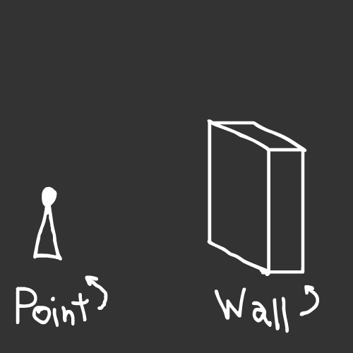

The point wants to face *this* direction:

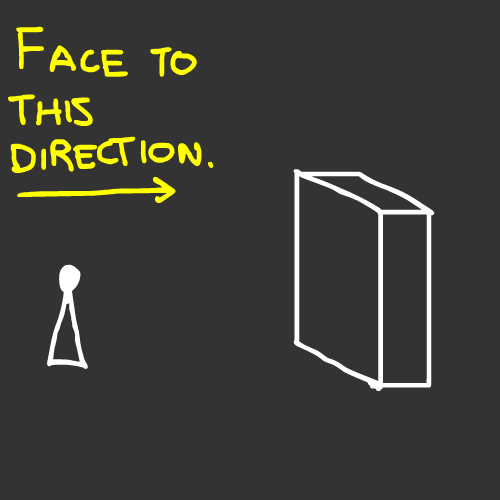

But the point, wants to know if there's something in there that can collide with its vision:

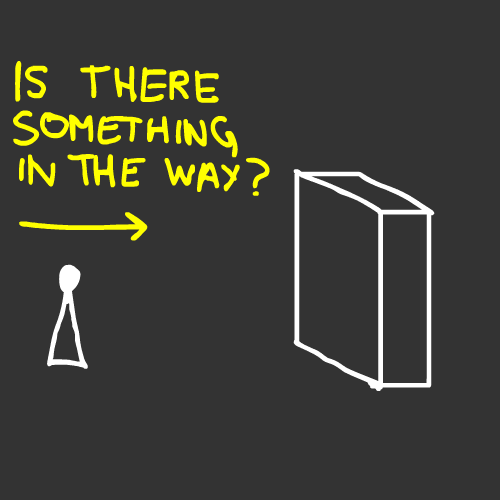

**How do we figure out if its something in the point's way?**

Well, that's what the raycasting is for!

We spawn a raycast and tell it, its origin, the direction is facing (in this case, the point's direction), and the maximum distance that can be from 0 to Infinity:

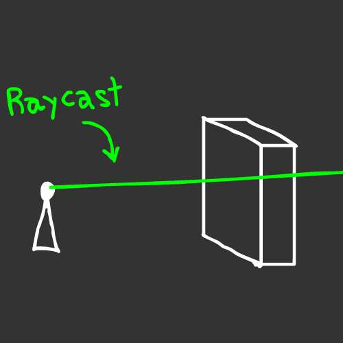

Thanks to this Ray, we can clearly determine that a wall is obstructing the point's view:

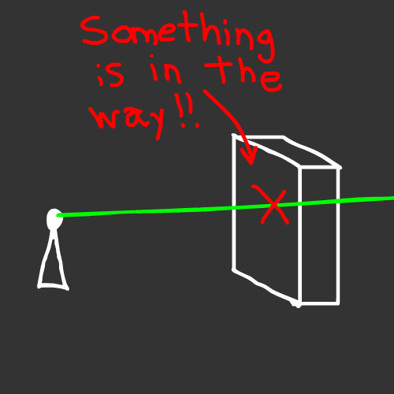

But you can do more with Raycasting, for instance, with the same example, we can determine if more than one object is hitting the ray:

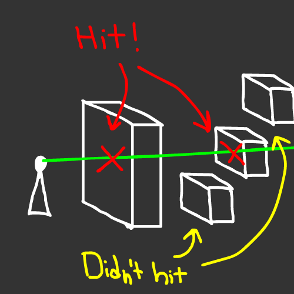

Or what if we want to change the direction of the point instead?:

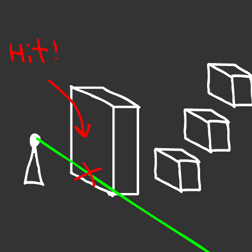

Or, change the distance to a small number so the point's view is limited:

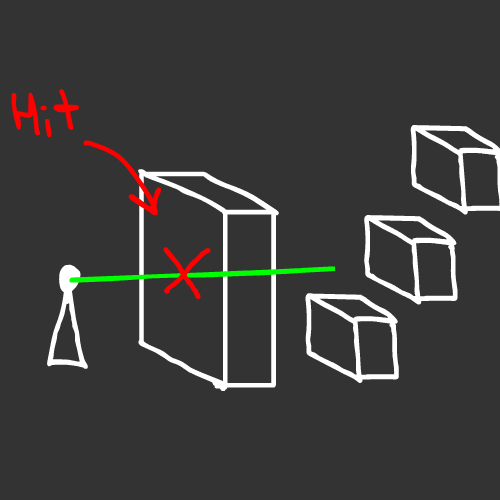

**The posibilities are endless!**

So, now that you know all of this...

## Let's go back to coding!

Let's go back to the scene of our last tutorial.

And for this we're going to make a ScriptBehaviour struct/class, like when ScriptBehaviour was introduced for the first time in the first tutorial.

You can re-use the "SquareScript.h" (and SquareScript.cpp, if you made one), but that's up to you.

For this case, i'm going to make a file called "Player.h", but you can name it however you want :D

Inside this file i'm going to make a "Player" ScriptBehaviour struct:

```cpp
#ifndef GAME_PLAYER_H
#define GAME_PLAYER_H

#include "geometria.h"
#include "geometria/physics.h"

struct Player : public ScriptBehaviour
{

	void OnStart()
	{

	}

	void OnUpdate()
	{

	}

}; // Remember to add a ";" at the end.

#endif
```

Since we're going to use the Physics API, remember that we include their respective header files, just like we did in GameMain.h.

```cpp
#include "geometria.h"
#include "geometria/physics.h"
```

Now, let's see what are we going to code...

## The Plan.

Alright, so the plan goes something like this:

We're going to make a **teleportation mechanic**! Its pretty simple :D

If we press the "R" key on the keyboard, a Raycast is going to occur, that is going to originate from the center of our yellow cube, facing down in the Y axis, and have a distance of "1". This raycast is going to be our floor checker.

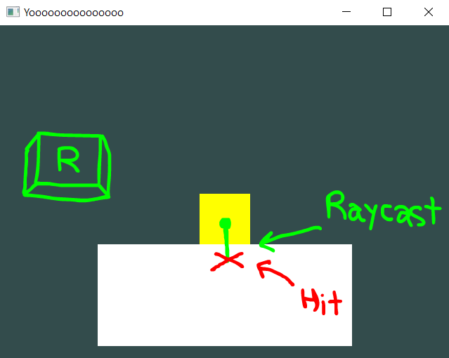

If the Ray detects a ground, its going to teleport the square to its origin, and because it has the Rigidbody component, it'll be affected by gravity, making it fall again and hit the floor.

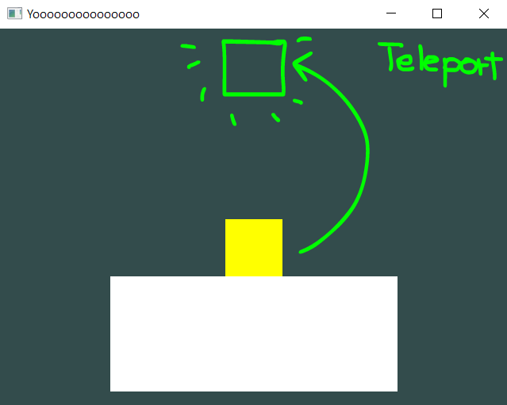

Alright then, we have the plan, now...

## Let's code the mechanic!

Let's go to our ```OnUpdate()``` function, and add an Input if statement. You can use ```Input::GetKey()```, but in this case i'm going to use ```Input::GetKeyDown()```, which is going to check if the input is pressed, but not held.

```cpp
void OnUpdate()
{
	if(Input::GetKeyDown(GLFW_KEY_R))
	{

	}
}
```

Next, we're going to add the Raycasting. We do this by adding the ```PhysicsManager::Raycast()```.

Since this returns a boolean, we're going to do an if statement.

```cpp
void OnUpdate()
{
	if(Input::GetKeyDown(GLFW_KEY_R))
	{
		if(PhysicsManager::Raycast(...))
		{

		}
	}
}
```

Now, we're going to apply the three parameters we need to add inside the Raycast function:

- First, **the origin**:

	Since the origin is the center of the Player, we're going to add ```GetTransform()->position``` to the origin.

- Second, **the direction**:

	Because we want to check the floor, we want the Ray to face downwards. You can achieve this by either adding ```Vector3::down()``` or ```Vector3(0, -1, 0)``` (both are the same).

- And Third and final parameter, **the distance**:

	We want a small distance to only check the floor, so we're going to add "1".

Now that we established the values, let's add them in the code:

```cpp
void OnUpdate()
{
	if(Input::GetKeyDown(GLFW_KEY_R))
	{
		if(PhysicsManager::Raycast(GetTransform()->position, Vector3::down(), 1))
		{

		}
	}
}
```

And now, let's code what happens when the ground is detected.

If hitting the ground is "true", we're going to teleport it back to its origin (0, 2, -5).

But we're not going to use ```GetTransform()``` to set the position, we're going to use another different function...

## Introducing GetRigidbodyTransform().

```GetRigidbodyTransform()``` is a function used specifically to get the object's transform, like ```GetTransform()```, but its given by the Rigidbody instead.

## Why i should use GetRigidbodyTransform() instead of GetTransform()?

Because the moment the Rigidbody component is added to the object, it gets full control over the ```GetTransform()``` parameter.

**So you can get the position, but you can't set the position.**

With ```GetRigidbodyTransform()``` you can set the position of the Rigidbody, which will set the position inside ```GetTransform()```.

So with that being said, let's write it inside the Raycast "if" statement.

For this, you can do two options, one is the quick approach, which is calling ```GetScript<Rigidbody>()``` in the Update function.

```cpp
void OnUpdate()
{
	if(Input::GetKeyDown(GLFW_KEY_R))
	{
		if(PhysicsManager::Raycast(GetTransform().position, Vector3::down(), 1))
		{
			GetScript<Rigidbody>()->GetRigidbodyTransform().position = Vector3(0, 2, -5);
		}
	}
}
```

Which is a good approach, not saying it isn't, but if you're looking for performance, what you can do is:

- Add a Rigidbody pointer with nullptr at the beginning of the Player struct:

	```cpp
	#ifndef GAME_PLAYER_H
	#define GAME_PLAYER_H
	
	#include "geometria.h"
	#include "geometria/physics.h"
	
	struct Player : public ScriptBehaviour
	{
		Rigidbody rb = nullptr;
	
		... // The rest of the code
	};
	```

- Call ```GetScript<Rigidbody>()``` on the ```OnStart()``` function:

	```cpp
	void OnStart()
	{
		rb = GetScript<Rigidbody>();
	}
	```

- And finally, inside ```OnUpdate()```, use "rb" to change the position:

	```cpp
	void OnUpdate()
	{
		if(Input::GetKeyDown(GLFW_KEY_R))
		{
			if(PhysicsManager::Raycast(GetTransform().position, Vector3::down(), 1))
			{
				rb->GetRigidbodyTransform().position = Vector3(0, 2, -5);
			}
		}
	}
	```

The second option is one of the most performant solutions, but if you want, you can try the first one without any worries :D

**Alright! We're done coding the script!**

## Let's go back to GameMain.h...

Back in GameMain.h, we're going to include the script file so we can add it to the "rigidBody".

In my case, i added the "Player.h" file in the same directory as GameMain.h, so i can add it like this:

```cpp
#pragma once

#include "geometria.h"
#include "geometria/physics.h"

#include "Player.h"

struct GameMain
{
	... // The rest of the code.
```

And once its included, you can go and add the finished script!

```cpp
... // Top code

rigidBody->AddScript<Rigidbody>();
rigidBody->AddScript<BoxCollider>();
rigidBody->AddScript<Player>();

... // Bottom code
```

## The Result.

Just like the last tutorial, a fully finished code is not going to be shown. If you managed to do it the first time, you can do it a second time! I believe in you! :D

If we compile and run the game, you can see that it starts like the Rigidbody example, but if we press "R", its going to teleport to its origin and fall until it hits the floor!

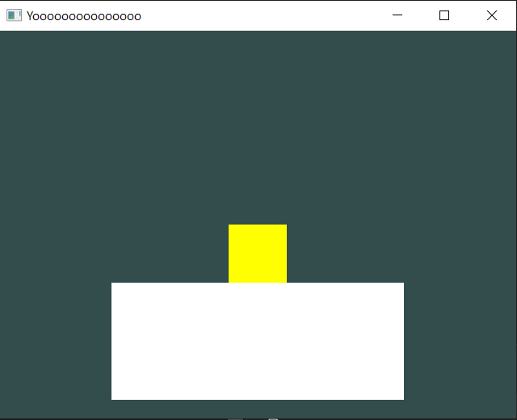

*If "R" is pressed...*

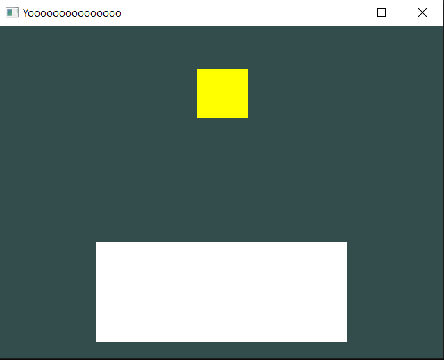

## But there's a problem...

If we press "R" again while we're in mid-air, its going to teleport back again, even if the player didn't hit the floor...

What is the problem?

## The Raycast function "as-is" is too straight-forward for this situation.

This function doesn't check only the floor, it checks everything that is a collider, no matter what.

So, since we're spawning the ray from the center of the Rigidbody, and the Rigidbody is a collider, **the Raycast thinks the Rigidbody is the floor aswell**.

Let's go back to our script and see what we can do...

We have two solutions, one is to lower down the origin of the Raycast by 1 unit:

```cpp
... // Top code

Vector3 origin = Vector3(GetTransform().position.x, GetTransform().position.y - 1, GetTransform().position.z);
if(PhysicsManager::Raycast(origin, Vector3::down(), 1))
{

... // Bottom code
```

But its still going to apply for everything, so you can't make specific surfaces "jumpable" instead of every surface.

The other solution, that even allows you to not even modify the origin, is to use something specifically used for Raycast analysis...

## Introducing the "RaycastBuffer".

The [**RaycastBuffer**](/api/Physics/PhysicsManager.md?id=raycastbuffer) is an object specifically made for deep Raycasting analysis, that allows you to get **A TON** of data, and inside that list of data, you can **check the objects that the Ray hits**.

To start using it, you need to add it before the Raycast function is executed:

```cpp
... // Top code

RaycastBuffer rBuffer;

... // Bottom code
```

And then, **add the "rBuffer" as the last parameter in the Raycast function**:

```cpp
... // Top code

RaycastBuffer rBuffer;
PhysicsManager::Raycast(GetTransform().position, Vector3::down(), 1, rBuffer);

... // Bottom code
```

*You can remove the "if()" that encapsulates ```PhysicsManager::Raycast()``` since we're going to use another function provided by the RaycastBuffer, but this is something optional, nothing bad is going to happen.*

After we made the Raycast, we're going to use the "rBuffer" to check if the ray hit anything **except the Player**.

**How do we do this?**

We do this by using the ```HitAnythingExcept()``` boolean function!

```cpp
... // Top code

RaycastBuffer rBuffer;
PhysicsManager::Raycast(GetTransform().position, Vector3::down(), 1, rBuffer);

if(rBuffer->HitAnythingExcept(GetScript<BoxCollider>()))
{

... // Bottom code
```

```rBuffer->HitAnythingExcept(GetScript<BoxCollider>())``` is going to check if any object is being hit, except of the player's Box Collider. So we can use this to totally discard the player's hitbox when checking for the floor.

So we end up with something similar to this:

```cpp
... // Top code

RaycastBuffer rBuffer;
PhysicsManager::Raycast(GetTransform().position, Vector3::down(), 1, rBuffer);

if(rBuffer.HitAnythingExcept(GetScript<BoxCollider>()))
{
	rb->GetRigidbodyTransform().position = Vector3(0, 2, -5);
}
... // Bottom code
```

If you want a more performant option, you can actually do the same thing as the second [Rigidbody](/api/Physics/Rigidbody.md) approach, but with the [BoxCollider](/api/Physics/BoxCollider.md), if you want:

```cpp
... // Top code

BoxCollider bC = nullptr;

... // More code

bC = GetScript<BoxCollider>();

... // More code

if(rBuffer.HitAnythingExcept(bC))
{

... // Bottom code
```

## Final Result.

If we compile and run it, you can see that if we're in mid-air now, we're not going to be able to teleport again until the Raycast hits the floor!

## Congratulations!

You now know how to do Raycasting! Next chapter is going to be about [**Triggers**](/physics/introducing-triggers.md), its gonna be fun so see you in that chapter! :D