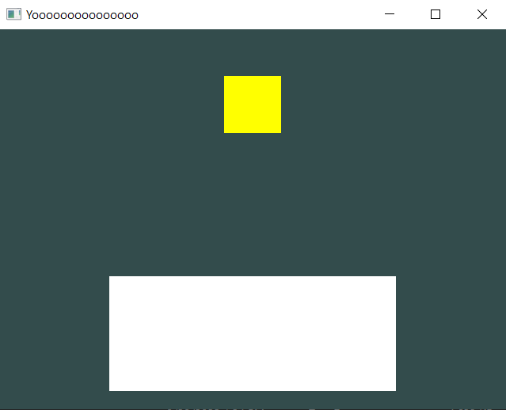
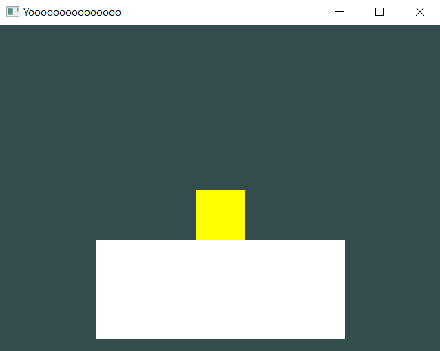

# The Rigidbody

Welcome to the second chapter of this physics tutorial!

In this section, we're going to introduce **dynamic objects**. Objects that are affected by gravity, by force and other elements in the physics world.

The component that turns a static object into a dynamic one is known as the [**Rigidbody**](/api/Physics/Rigidbody.md).

## What is the Rigidbody?

A Rigidbody is a ScriptBehaviour component that adds the concept of gravity and force into any collider.

By combining a Collider component with the Rigidbody, you can turn any model into a dynamic prop.

It's pretty much easy and straight-forward, but the good thing about this component is that you can manipulate it via code.

You can set the velocity, apply forces and much more. Which can be used, for example, to code a controllable platformer character that can interact with static collisions around it, like walking on top of them, using it to jump from one platform to another and the list goes on... *(Reminder that this is something that we're going to code at the end of the Physics chapter)*.

But first, let's get a basic Rigidbody into our coding scene.

## Let's get started!

Let's start with the basic scene, but we're going to add two models instead.

One model is going to be the floor, and the other one is going to be the rigidbody *(with the neat addition of setting a yellow color to it :D)*.

```cpp
static void Init()
{
	DrawCall* d = SceneManager::MainScene().CreateDrawCall();

	Model* floor = new Model(Model::Primitives::SQUARE, Vector3(0, -2, -5), Vector3(0), Vector3(5, 2, 1));
	Model* rigidBody = new Model(Model::Primitives::SQUARE, Vector3(0, 2, -5), Vector3(0), Vector3(1));
	rigidBody->color = Color::yellow();

	RendererCore::AddModel(*floor, d->Target());
	RendererCore::AddModel(*rigidBody, d->Target());
}
```

If you compile and run it, it should look like this:



Now, let's add a box collider to both of them!

```cpp
floor->AddScript<BoxCollider>();

rigidBody->AddScript<BoxCollider>();
```

And as the final touch, we add the [**Rigidbody**](/api/Physics/Rigidbody.md) component to the "rigidBody" object!

```cpp
rigidBody->AddScript<Rigidbody>();
rigidBody->AddScript<BoxCollider>();
```
> [!WARNING]
> You have to follow an order for this to work. Adding the **BoxCollider** first and the **Rigidbody** last its not going to work properly.

## Final Result.

For this, i'm going to show the code's final result.

Consider this as a little excercise! :D

Try to figure out yourself what is the Final Result going to look like coding-wise.

You don't have to follow the tutorials 100% as you're told, make your own path and try to connect what you've learned with the last tutorials. 

If this is your first time in programming or your first time touching C++, doing this will actually let you figure out that you can connect what you've learned, mix that knowledge together and code with it like if you were building a LEGO set.

**Final Result is only going to be shown visually**:

The yellow square should fall and hit the floor once it touches.



If that's the case for you then...

## Congratulations!

You made it! You made your first dynamic physics scene!

Now, in the next chapter, we're jumping back into script programming like we did with the "SquareScript.h" back in the "Hello World" Tutorial!

We're going to take a look at [**The Basics of Raycasting**](/physics/the-basics-of-raycasting.md), see you there! :D