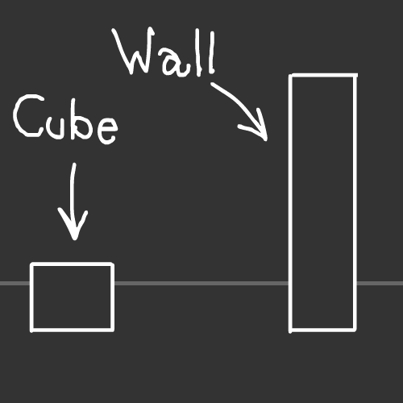
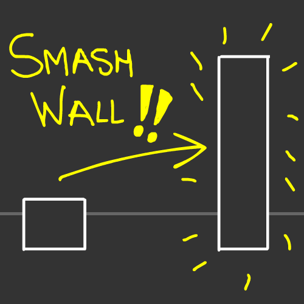
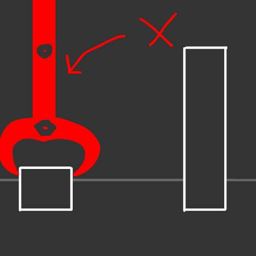
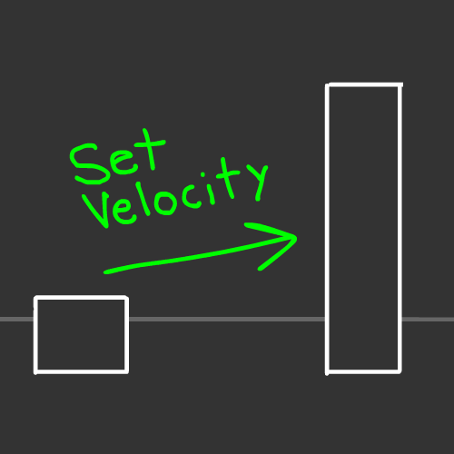
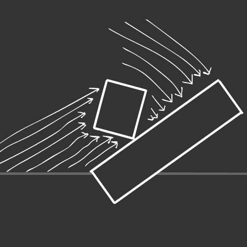

# Velocity Manipulation

Welcome to this next chapter of this incredible Physics tutorial!

This is going to the last section before we bundle up everything we learned into a **little game**! :D

But before jumping straight into it, you must've be asking yourself...

## What is "Velocity Manipulation"?

"Velocity Manipulation" is the concept of controlling the speed of a Physics Object inside the Physics world.

This can be used to control characters or objects and being able to react to physics at the same time.

## Let me show you an example in form of a drawing!

We have a little **Cube** and this **Wall** in a nice dark grey canvas:

In here, our goal is to **SMASH THE WALL** and **destroy it** with the cube:

But there's a problem, we don't have a physical tool like a craine that can help us attach the cube to it and tear down that wall, and we can't build one either:

So how do we do it?

**Well, this is a virtual world, so let's manipulate the velocity of the object!**

By applying a certain speed, we can move it to a certain direction:

And once we execute that function with an **extremely high** speed, it'll push itself so fast that it'll knock down the wall!

